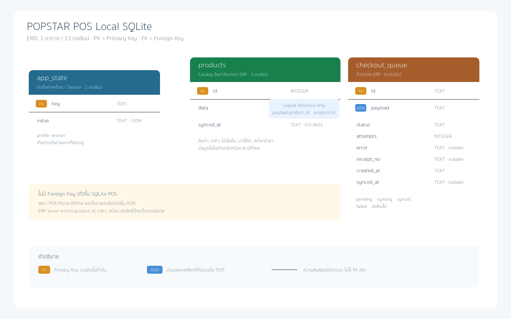

# โครงสร้าง SQLite ของ POPSTAR POS Local

เอกสารนี้อธิบายฐานข้อมูล SQLite ที่อยู่ในเครื่อง POS Desktop (`popstar-pos.db`) ตามโค้ดปัจจุบันของแอป

## สรุป

- จำนวนตารางที่แอปสร้างและใช้งาน: **5 ตาราง**
- จำนวนคอลัมน์รวม: **27 คอลัมน์**
- ฐานข้อมูลนี้เป็นฐานข้อมูลประจำเครื่อง POS ไม่ใช่ฐานข้อมูล ERP ส่วนกลาง
- ไม่มีรหัสผ่าน Device Token อยู่ใน SQLite เพราะเก็บใน Windows Credential Manager
- ยังไม่มีการเก็บต้นทุนหรือบัญชีใน SQLite; ERP Server เป็นผู้ตรวจราคา ตัดสต๊อก และลงบัญชี

## ตารางทั้งหมด



ภาพ ERD นี้แสดง 3 ตารางแกนหลักเดิม ส่วน `pos_sale_history` ซึ่งเพิ่มสำหรับประวัติใบเสร็จอธิบายไว้ในตารางที่ 4 ด้านล่าง

ไฟล์ภาพต้นฉบับแบบขยายได้: [`pos-local-sqlite-erd.svg`](assets/pos-local-sqlite-erd.svg)

### 1. `app_state` — ค่าการตั้งค่าและ Session ของเครื่อง

| คอลัมน์ | ชนิด | กติกา | เก็บข้อมูลอะไร |
|---|---|---|---|
| `key` | `TEXT` | `PRIMARY KEY` | ชื่อค่าที่เก็บ เช่น `profile`, `session` |
| `value` | `TEXT` | `NOT NULL` | ข้อมูล JSON ของค่าตาม `key` |

ค่าที่ใช้อยู่:

- `profile`: URL ERP, ชื่อเครื่อง, รหัสเครื่อง POS, สาขา, VAT, ข้อมูลบริษัท และรูปแบบใบเสร็จ
- `session`: แคชเชียร์และกะที่กำลังเปิดอยู่

ตัวอย่าง:

```json
{
  "key": "profile",
  "value": "{\"terminalCode\":\"POS-001\",\"branchId\":1}"
}
```

### 2. `products` — Catalog สินค้าและราคาที่ซิงก์มาไว้ในเครื่อง

| คอลัมน์ | ชนิด | กติกา | เก็บข้อมูลอะไร |
|---|---|---|---|
| `id` | `INTEGER` | `PRIMARY KEY` | รหัสสินค้าเดียวกับ ERP |
| `data` | `TEXT` | `NOT NULL` | JSON สินค้า ราคา โปรโมชั่น บาร์โค้ด และสต๊อกสาขา |
| `synced_at` | `TEXT` | `NOT NULL` | วันเวลาที่รายการนี้ซิงก์จาก ERP ล่าสุด รูปแบบ ISO 8601 |

ข้อมูลใน `data` อาจประกอบด้วย:

- `sku_code`, `name_th`
- `pos_price`, `normal_price`
- `stock_qty`
- `is_promotion`, `is_flash_sale`
- `barcodes[]` และหน่วยบรรจุ
- `margin_percent`, `margin_warning` สำหรับแสดงคำเตือนเท่านั้น

เมื่อซิงก์ใหม่ แอปจะลบ Catalog เดิมแล้วเขียนชุดล่าสุดลงตารางนี้ แต่ไม่ลบ `checkout_queue`

### 3. `promotions` — โปรโมชั่นซื้อครบที่ซิงก์จาก ERP

| คอลัมน์ | ชนิด | กติกา | เก็บข้อมูลอะไร |
|---|---|---|---|
| `id` | `INTEGER` | `PRIMARY KEY` | รหัสโปรโมชั่นจาก ERP |
| `data` | `TEXT` | `NOT NULL` | JSON ประเภทโปรโมชั่น เงื่อนไข และสินค้าแถม |
| `synced_at` | `TEXT` | `NOT NULL` | วันเวลาที่ซิงก์ล่าสุด |

POS ใช้ข้อมูลนี้เป็น Catalog Offline เท่านั้น ส่วน Laravel จะคำนวณและยืนยันราคาจริงอีกครั้งตอน checkout

### 4. `checkout_queue` — คิวบิลขายที่รอส่ง ERP

| คอลัมน์ | ชนิด | ค่าเริ่มต้น/กติกา | เก็บข้อมูลอะไร |
|---|---|---|---|
| `id` | `TEXT` | `PRIMARY KEY` | Idempotency Key เช่น `POS-001:SALE:<uuid>` ป้องกันบิลซ้ำ |
| `payload` | `TEXT` | `NOT NULL` | JSON รายละเอียดบิลที่จะส่ง `/api/pos/checkout` |
| `status` | `TEXT` | `pending` | สถานะ `pending`, `syncing`, `synced`, `failed` |
| `attempts` | `INTEGER` | `0` | จำนวนครั้งที่พยายามส่งหรือเปลี่ยนสถานะ |
| `error` | `TEXT` | ว่างได้ | ข้อความผิดพลาดล่าสุดเมื่อส่งไม่สำเร็จ |
| `receipt_no` | `TEXT` | ว่างได้ | เลขใบเสร็จที่ ERP ตอบกลับเมื่อส่งสำเร็จ |
| `created_at` | `TEXT` | `NOT NULL` | วันเวลาที่สร้างคิวบิล |
| `synced_at` | `TEXT` | ว่างได้ | วันเวลาที่ ERP รับบิลสำเร็จ |

สถานะคิวทำงานดังนี้:

```text
pending -> syncing -> synced
                 \-> failed -> syncing (เมื่อส่งใหม่)
```

การเปิด POS ใหม่จะอ่านคิวทุกสถานะที่ยังไม่ใช่ `synced` แล้วส่งต่ออีกครั้ง โดยใช้ `id` เดิม จึงไม่สร้างบิลซ้ำที่ ERP

### 5. `pos_sale_history` — ประวัติใบเสร็จย้อนหลังในเครื่อง POS

ตารางนี้สร้างขึ้นเพื่อให้แคชเชียร์เปิดดูใบเสร็จย้อนหลังได้แม้อินเทอร์เน็ตล่ม โดยเก็บประวัติสูงสุด 90 วันและลบรายการที่เก่ากว่าโดยอัตโนมัติเมื่อเปิดฐานข้อมูล

| คอลัมน์ | ชนิด | กติกา | เก็บข้อมูลอะไร |
|---|---|---|---|
| `id` | `TEXT` | `PRIMARY KEY` | Idempotency Key เดียวกับ `checkout_queue` |
| `receipt_no` | `TEXT` | `NOT NULL` | เลขชั่วคราว หรือเลขใบเสร็จที่ ERP ตอบกลับ |
| `status` | `TEXT` | `NOT NULL` | `pending`, `syncing`, `synced`, `failed` |
| `total` | `REAL` | `NOT NULL` | ยอดรวม ณ ตอนขาย |
| `method` | `TEXT` | `NOT NULL` | วิธีชำระเงิน |
| `paid` | `REAL` | `NOT NULL` | เงินที่รับ |
| `change_amount` | `REAL` | `NOT NULL` | เงินทอน |
| `items` | `TEXT` | `NOT NULL` | JSON รายการสินค้า ชื่อ ราคา และจำนวน ณ ตอนขาย |
| `printed_at` | `TEXT` | `NOT NULL` | วันเวลาที่ออกบิล |
| `error` | `TEXT` | ว่างได้ | ข้อผิดพลาดล่าสุดของการซิงก์ |
| `synced_at` | `TEXT` | ว่างได้ | วันเวลาที่ ERP รับบิลสำเร็จ |

การเปลี่ยนสถานะของ `checkout_queue` จะอัปเดตประวัติด้วย ทำให้ประวัติแสดงได้ว่าบิลใดส่ง ERP แล้วหรือยัง และสามารถเลือกบิลเพื่อดูรายละเอียดหรือพิมพ์ซ้ำได้จากเมนู **ประวัติการขาย**

## ความสัมพันธ์ของข้อมูล

```text
app_state
  ├── profile  -> ตั้งค่าเครื่อง/สาขา/บริษัท
  └── session  -> แคชเชียร์/กะ

products
  └── id       -> อ้างถึง product_id ใน checkout_queue.payload

promotions
  └── data     -> เงื่อนไขโปรโมชั่นสำหรับแสดง/ทำงาน Offline

checkout_queue
  └── payload  -> รายการขาย, จำนวน, ราคา, บาร์โค้ด, วิธีชำระเงิน

pos_sale_history
  └── id       -> อ้างอิง checkout_queue.id ทางตรรกะ (ไม่มี Foreign Key จริง)
```

SQLite ของ POS ไม่มี Foreign Key ไปยัง ERP เพราะเป็นฐานข้อมูล Offline คนละเครื่อง ข้อมูลจริงจะถูกตรวจซ้ำที่ ERP ตอนซิงก์

## ตรวจสอบด้วยคำสั่ง SQLite

```sql
PRAGMA integrity_check;
SELECT name FROM sqlite_master WHERE type = 'table';
PRAGMA table_info(app_state);
PRAGMA table_info(products);
PRAGMA table_info(promotions);
PRAGMA table_info(checkout_queue);
PRAGMA table_info(pos_sale_history);
SELECT status, COUNT(*) FROM checkout_queue GROUP BY status;
SELECT status, COUNT(*) FROM pos_sale_history GROUP BY status;
```

ผล `PRAGMA integrity_check` ที่ถูกต้องต้องเป็น:

```text
ok
```

## สิ่งที่ไม่อยู่ใน SQLite POS

- Device Token: Windows Credential Manager
- ผังบัญชีและรายการบัญชี: ERP Server
- สต๊อกคงเหลือจริงและต้นทุน FIFO/FEFO: ERP Server
- ใบเสร็จฉบับจริงของทุกสาขา: ERP Server หลังซิงก์สำเร็จ; POS เก็บสำเนาเพื่อดูย้อนหลัง 90 วัน
- โปรโมชั่นต้นฉบับ: ERP Server; POS เก็บเฉพาะ Catalog ที่ซิงก์มาใช้ชั่วคราว

## การสำรองและกู้คืน

ใช้เมนู **ตั้งค่าเครื่อง POS > สุขภาพ POS Local**:

1. ตรวจ SQLite และคิวบิล
2. กด **สำรอง SQLite** ก่อนซ่อมหรือเปลี่ยนเครื่อง
3. ห้ามกู้คืนถ้ายังมีบิล `pending`, `syncing` หรือ `failed`
4. Restore จะสร้างไฟล์ `pre-restore` ก่อน แล้วจึงกู้ Backup ล่าสุด

อย่าเปิดแก้ `popstar-pos.db` ด้วยโปรแกรมอื่นระหว่าง POS ทำงาน และอย่าลบไฟล์นี้ก่อนตรวจสอบคิวขาย
