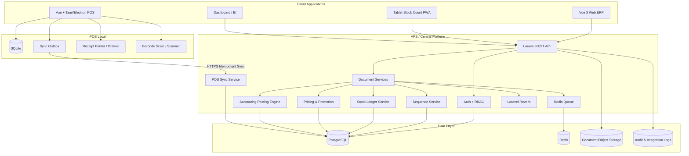
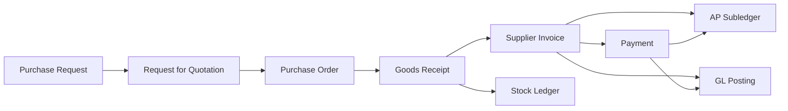
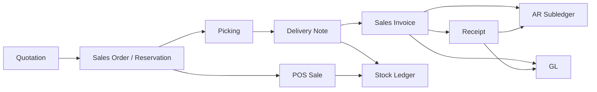
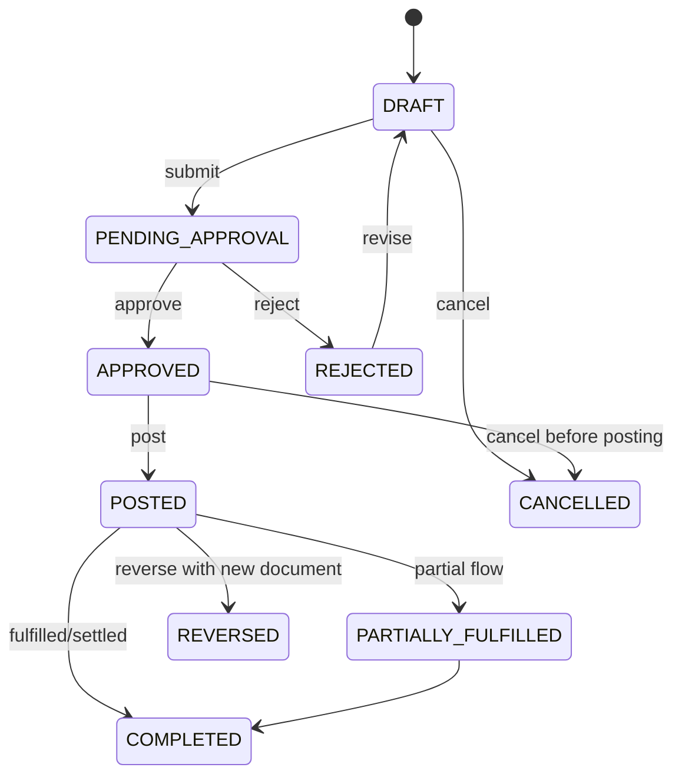

# BPLUS → MODERN ERP REBUILD BLUEPRINT

> เอกสารสรุปคู่มือ `BplusBack.chm` และแปลงเป็นข้อกำหนดสำหรับพัฒนา ERP ใหม่  
> เป้าหมายเทคโนโลยี: **Laravel 11 + PostgreSQL + Redis + Vue 3** และ **POS Offline ด้วย Vue + Tauri/Electron + SQLite**

---

## 0. ข้อมูลเอกสาร

| รายการ | ค่า |
|---|---|
| แหล่งอ้างอิง | `BplusBack.chm` |
| รูปแบบต้นฉบับ | Microsoft Compiled HTML Help (CHM) |
| ขนาดไฟล์ต้นฉบับ | 6,540,584 bytes |
| รายการภายใน CHM | 5,189 รายการ |
| หน้า HTML | 1,717 หน้า |
| รูปภาพ PNG | 1,103 ไฟล์ |
| รูปภาพ JPG | 665 ไฟล์ |
| รูปภาพ GIF | 107 ไฟล์ |
| สารบัญ | `Default.hhc` |
| ดัชนีค้นหา | `Index.hhk` |
| หน้าเริ่มต้น | `01Bplusback.htm` |
| วันที่จัดทำ | 30 กรกฎาคม 2026 |

### สถานะของเอกสารนี้

เอกสารนี้เป็น **Functional & Technical Blueprint** สำหรับสร้างระบบ ERP ใหม่ โดยใช้โครงสร้างหัวข้อจากคู่มือ Bplus ร่วมกับ workflow ERP มาตรฐานและรูปแบบการใช้งานจริงของ Popstar Food Trading

เอกสารนี้ **ไม่ใช่การคัดลอกหน้าจอหรือซอร์สโค้ดของ Bplus** และไม่ควรออกแบบระบบใหม่ให้ผูกกับชื่อฟิลด์หรือข้อจำกัดของโปรแกรมเดิมโดยไม่จำเป็น

ระดับความมั่นใจของ requirement:

- **A — Verified:** พบหมวดหรือรายการใน CHM และ/หรือใช้งานจริงในฐาน Bplus เดิม
- **B — Derived:** สรุปจาก workflow ของโมดูลและความเชื่อมโยงทางบัญชี
- **C — Enhancement:** ความสามารถที่ควรเพิ่มใน ERP ใหม่เพื่อแก้ข้อจำกัดของระบบเดิม

---

# 1. Executive Summary

ERP ใหม่ต้องไม่เป็นเพียงโปรแกรมบันทึกเอกสาร แต่ต้องเป็นระบบธุรกรรมแบบครบวงจรที่มีคุณสมบัติหลักดังนี้

1. **Single Source of Truth** — ข้อมูลสินค้า ราคา ลูกค้า เจ้าหนี้ สต๊อก และบัญชีมีแหล่งข้อมูลกลางเดียว
2. **Ledger First** — สต๊อก การเงิน และบัญชีเกิดจากรายการเคลื่อนไหวที่ตรวจสอบย้อนหลังได้ ไม่แก้ยอดคงเหลือโดยตรง
3. **Document Lifecycle** — ทุกเอกสารมีสถานะ การอนุมัติ การอ้างอิงเอกสารต้นทาง และประวัติการเปลี่ยนแปลง
4. **Multi-Branch / Multi-Warehouse** — แยกสิทธิ์และยอดตามบริษัท สาขา คลัง และตำแหน่งจัดเก็บ
5. **Offline-First POS** — POS ต้องขายได้แม้อินเทอร์เน็ตล่ม และ sync กลับ VPS อย่าง idempotent
6. **Integrated Posting** — เอกสารที่ถูก post ต้องสร้าง stock ledger, subledger และ GL journal ตามกฎเดียวกัน
7. **Immutable Posted Data** — เอกสารที่ post แล้วห้ามแก้ทับ ต้องยกเลิกหรือ reverse ด้วยรายการใหม่
8. **Auditability** — ทุกการสร้าง แก้ไข อนุมัติ post ยกเลิก และ sync ต้องมี audit trail
9. **API-First** — Web ERP, POS, mobile stock count และ integration ใช้ API ชุดเดียวกัน
10. **Operationally Deployable** — ต้องมี backup, monitoring, queue retry, migration, test และ rollback plan ตั้งแต่ต้น

---

# 2. ภาพรวมหมวดในคู่มือ CHM

จำนวนหน้าด้านล่างนับจากชื่อไฟล์ HTML ภายใน CHM เพื่อใช้กำหนดขนาดงาน ไม่ได้หมายความว่าแต่ละหน้าจะเท่ากับหนึ่ง feature

| รหัสหมวด | จำนวนหน้า | การตีความสำหรับระบบใหม่ | ระดับ |
|---|---:|---|---|
| OE | 211 | Order Entry / กระบวนการเอกสารขายและคำสั่งซื้อ | A/B |
| AR | 155 | ลูกหนี้การค้า การรับชำระ และเครดิตลูกค้า | A |
| IC | 146 | สินค้า หน่วยนับ คลัง สต๊อก และต้นทุน | A |
| SP | 129 | หมวดกระบวนการเฉพาะในคู่มือ ต้อง trace รายหน้าเมื่อลงรายละเอียด | A |
| PR | 126 | จัดซื้อ รับสินค้า และเอกสารที่เกี่ยวข้อง | A/B |
| GL | 105 | บัญชีแยกประเภท ผังบัญชี และการปิดงวด | A |
| BK | 101 | เงินสด ธนาคาร เช็ค รับ–จ่าย | A |
| AP | 88 | เจ้าหนี้การค้า ใบตั้งหนี้ และชำระหนี้ | A |
| MC | 70 | Master/Control หรือกระบวนการเฉพาะตามคู่มือ | A/B |
| SL | 67 | งานขายและรายงานยอดขาย | A/B |
| PY | 48 | Payroll / เงินเดือน | A |
| CS | 33 | หมวดงานบริการหรือกระบวนการเฉพาะ | A/B |
| FA | 29 | สินทรัพย์ถาวรและค่าเสื่อมราคา | A |
| TR | 27 | รายการโอน/ธุรกรรม/รายงานเฉพาะ | A/B |
| SC | 24 | ระบบควบคุมหรือเอกสารเฉพาะ | A/B |
| MB | 23 | โมดูลเฉพาะ/ส่วนเสริม | A/B |
| PS | 23 | POS หรือกระบวนการขายหน้าร้าน | A/B |
| RP | 17 | รายงาน | A |
| WH | 17 | คลังสินค้าและตำแหน่งจัดเก็บ | A |
| SY | 15 | ตั้งค่าระบบ ผู้ใช้ และสิทธิ์ | A |
| EQ | 12 | อุปกรณ์หรือสินทรัพย์ที่เกี่ยวข้อง | A/B |
| DC | 11 | Document/Distribution Control | A/B |
| BR | 9 | บริษัท/สาขา | A |
| RM | 8 | หมวดเฉพาะ เช่น วัตถุดิบหรือรายงาน | A/B |

หัวข้อเชิงพฤติกรรมที่พบจากชื่อไฟล์ เช่น:

- `Accountchart`, `AccGl`, `FinalGl`
- `ChartProduct`, `IcBrand`, `IcColor`, `IcSize`, `IcGroup`, `IcStro`
- `ChartPo`, `PreparePo`, `PreparePoExcel`, `PreparePoSet`
- `Sale`, `Sales`, `SalesCash`, `SalesReturn`, `SaleQr`
- `PackingList`, `PackingListD`, `PackingListSet`
- `PaymentTerm`, `ShipTo`, `SelectAddress`
- `VatP`, `VatS`, `SortVatP`, `SortVatS`
- `ChartCash`, `ChartCredit`, `ChartDabit`, `ChartPayCheq`, `ChartReCheq`
- `Backup`, `Restore`, `Compact`, `Grant`, `CurrentUser`
- `PosOnline`, `POSWINIC`, `PosIcWin`

---

# 3. Target Architecture



## 3.1 Technology Decisions

| Layer | Technology | หลักการ |
|---|---|---|
| Backend | Laravel 11 / PHP 8.3+ | Modular monolith ก่อน แยก service เมื่อมีเหตุผลจริง |
| Frontend | Vue 3 + TypeScript | Composition API, Pinia, Vue Router |
| Database | PostgreSQL | ACID, row locking, JSONB เฉพาะข้อมูลยืดหยุ่น |
| Cache/Queue | Redis | cache, distributed lock, job queue, rate limit |
| Realtime | Laravel Reverb | แจ้งเตือน สถานะ sync และ dashboard |
| POS Desktop | Tauri เป็นตัวเลือกหลัก | เบากว่า Electron; ใช้ Electron เมื่อ library hardware บังคับ |
| POS Local DB | SQLite | transaction local, outbox queue, offline catalog |
| API | REST/JSON | versioned API, idempotency, cursor pagination |
| Files | S3-compatible/Object storage | รูปสินค้า เอกสารแนบ export และ backup |
| Monitoring | Logs + Metrics + Health Checks | queue, sync, DB, disk, error rate |

## 3.2 Modular Monolith Boundary

แนะนำให้เริ่มเป็น modular monolith โดยแยก bounded context ชัดเจน:

```text
app/Domains/
├── Foundation
├── Identity
├── Catalog
├── Pricing
├── Procurement
├── Inventory
├── Sales
├── POS
├── Receivables
├── Payables
├── CashBank
├── Accounting
├── FixedAssets
├── Payroll
├── Reporting
└── Integration
```

ห้ามให้ Controller เขียน stock หรือ GL โดยตรง ต้องเรียก application service ของ domain เท่านั้น

---

# 4. Core Design Principles

## 4.1 Header–Line–Reference Pattern

เอกสารธุรกิจทุกชนิดควรใช้แนวคิดเดียวกัน:

```text
Document Header
├── Identity: document_type, document_no, branch, fiscal_date
├── Counterparty: customer/supplier
├── Commercial: currency, terms, price list, tax mode
├── Workflow: status, approval, posting
├── Totals: subtotal, discount, tax, net
└── Audit: created_by, approved_by, posted_by, timestamps

Document Lines
├── product/service/account
├── warehouse/location
├── quantity + unit
├── unit conversion
├── price/discount/tax
├── lot/serial/expiry
├── cost dimensions
└── source line reference
```

## 4.2 Posted Document Is Immutable

เมื่อเอกสาร `POSTED` แล้ว:

- ห้ามแก้ header และ line ที่มีผลทางธุรกิจ
- ห้ามลบเอกสารจริง
- ใช้ `VOID`, `CANCEL`, `REVERSE` หรือ credit/debit note
- การ reverse ต้องสร้าง stock movement และ journal ตรงข้าม
- ต้องเก็บผู้อนุมัติ เหตุผล และเวลาที่ทำรายการ

## 4.3 Ledger-Based Balance

ยอดคงเหลือเป็นผลรวมจาก ledger ไม่ใช่ field ที่แก้ได้อิสระ

```text
Stock On Hand = SUM(stock_ledger.qty_in - stock_ledger.qty_out)
Available      = On Hand - Reserved - Allocated + Incoming Available
AR Balance     = Invoice/Debit - Receipt/Credit/Write-off
AP Balance     = Supplier Invoice/Debit - Payment/Credit
GL Balance     = SUM(debit - credit) by account/dimension/period
```

เพื่อความเร็ว สามารถมี balance snapshot/materialized view ได้ แต่ต้อง rebuild จาก ledger ได้เสมอ

## 4.4 Source Document Traceability

ทุก line ต้องรองรับการอ้างอิงต้นทาง:

```text
Quotation Line
  → Sales Order Line
    → Pick/Delivery Line
      → Invoice Line
        → Return/Credit Note Line
```

และฝั่งซื้อ:

```text
Purchase Request Line
  → Purchase Order Line
    → Goods Receipt Line
      → Supplier Invoice Line
        → Debit/Credit Note Line
```

ห้ามใช้วิธีจับคู่เอกสารด้วยลูกค้าและช่วงวันที่เป็นแนวทางหลักในระบบใหม่

---

# 5. Foundation & Organization

## 5.1 Master Data

- `companies`
- `branches`
- `warehouses`
- `warehouse_locations`
- `departments`
- `projects`
- `cost_centers`
- `fiscal_years`
- `fiscal_periods`
- `currencies`
- `exchange_rates`
- `tax_codes`
- `payment_terms`
- `document_types`
- `document_sequences`
- `reason_codes`

## 5.2 Branch and Warehouse Isolation

ทุก transaction ต้องมีอย่างน้อย:

- `company_id`
- `branch_id`
- `document_date`
- `document_type_id`
- `document_no`

รายการที่กระทบสต๊อกต้องมี:

- `warehouse_id`
- `location_id` ถ้าเปิด location control
- `lot_id`/`serial_id` ตามชนิดสินค้า

## 5.3 Fiscal Control

สถานะงวด:

```text
OPEN → SOFT_CLOSED → CLOSED → LOCKED
```

- `OPEN`: บันทึกและ post ได้
- `SOFT_CLOSED`: post ได้เฉพาะผู้มีสิทธิ์
- `CLOSED`: ห้าม post transaction ใหม่
- `LOCKED`: ห้ามแก้ setup หรือ reopen โดยไม่มี approval พิเศษ

---

# 6. Identity, RBAC and Audit

## 6.1 Permission Model

ใช้ permission ระดับ action และ scope:

```text
sales.orders.view
sales.orders.create
sales.orders.approve
sales.orders.post
sales.orders.cancel
sales.orders.export
```

Scope:

- Company
- Branch
- Warehouse
- Department
- Own documents
- Team documents
- All documents

## 6.2 Segregation of Duties

อย่างน้อยต้องรองรับกฎ:

- ผู้สร้างเอกสารไม่ควรอนุมัติเอกสารวงเงินสูงของตนเอง
- ผู้รับสินค้าไม่ควรเป็นผู้อนุมัติ invoice ที่มีความแตกต่างเกิน tolerance
- ผู้รับเงินไม่ควรเป็นผู้ reconcile bank คนเดียวกัน
- ผู้ดูแล master data ไม่ควรย้อนแก้ posted transaction

## 6.3 Audit Log

บันทึก:

- actor/user/service
- action
- entity type + entity id
- before/after diff
- IP/device/terminal
- correlation id
- timestamp
- reason/comment

ข้อมูล audit ห้ามแก้ไขผ่าน UI ปกติ

---

# 7. Document Number & Sequence Service

## 7.1 รูปแบบเลขเอกสาร

ตัวอย่าง:

```text
SO-001-2607-000123
POS-001-T02-260730-000456
GR-009-2607-000078
JV-HQ-2607-000031
```

ส่วนประกอบ:

- ประเภทเอกสาร
- สาขา
- เครื่อง POS เมื่อจำเป็น
- ปี/เดือนหรือปีบัญชี
- running number

## 7.2 Central Sequence Rules

- ใช้ transaction/row lock หรือ PostgreSQL sequence
- unique constraint: `(company_id, document_type_id, fiscal_key, branch_id, terminal_id, running_no)`
- ห้ามหาเลขถัดไปด้วย `MAX(no)+1`
- เก็บเลขที่จอง เลขที่ใช้ และเลขที่ยกเลิก
- รองรับ reset รายเดือน/ปี/ปีบัญชี/ไม่ reset

## 7.3 Offline POS Number

POS ต้องออกใบเสร็จได้แม้ออฟไลน์:

```text
Display No. : POS-001-T02-260730-000456
Internal ID : UUID/ULID generated locally
```

แนวทาง:

1. เครื่อง POS ได้รับ block running number ล่วงหน้า หรือใช้ prefix เฉพาะเครื่อง
2. ทุก transaction มี `local_uuid`
3. server ใช้ `local_uuid` เป็น idempotency key
4. sync ซ้ำต้องคืนผลเดิม ไม่สร้างบิลใหม่
5. ถ้า block หมด ให้ใช้ emergency range ที่ audit ได้

---

# 8. Product, Barcode and Unit Management

## 8.1 Product Master

ฟิลด์หลัก:

- SKU code
- product name / short name / receipt name
- product type: stock, service, bundle, raw material, finished goods
- category, department, brand
- color, size, variant
- base unit
- purchase unit
- sales unit
- tax code
- costing method
- lot/serial/expiry policy
- negative stock policy
- active/discontinued
- image and attachments

## 8.2 Unit Conversion

```text
1 ลัง = 12 แพ็ก
1 แพ็ก = 6 ชิ้น
Base Unit = ชิ้น
```

เก็บ conversion เป็น rational/decimal ที่ควบคุม precision:

```text
product_units
- product_id
- unit_id
- factor_to_base
- barcode
- purchase_allowed
- sale_allowed
- decimal_allowed
```

ห้ามเปลี่ยน factor ของหน่วยที่ถูกใช้ใน posted transaction โดยตรง ให้ version หรือสร้างหน่วยใหม่

## 8.3 Barcode

รองรับ:

- EAN-13 / EAN-8
- UPC
- Code 128
- Supplier barcode
- Internal barcode
- Multiple barcode per product/unit
- Barcode scale

### Barcode Scale Rule

สำหรับโจทย์ปัจจุบัน:

```text
[Product Prefix 6 digits] + [Weight/Amount 6 digits] + [Check Digit]
```

ต้องทำเป็น configurable parser:

```json
{
  "format": "EAN13_WEIGHT",
  "product_start": 0,
  "product_length": 6,
  "value_start": 6,
  "value_length": 6,
  "value_divisor": 1000,
  "check_digit": true
}
```

ผลลัพธ์ parser ต้องระบุ:

- product
- interpreted weight/amount
- unit
- raw barcode
- validation status

## 8.4 Product Dimensions

แทนการ hard-code `brand/color/size` ใน product table ให้รองรับ attribute/variant:

```text
Product Template: ไก่หมัก
Variants:
- ขนาด 500 g
- ขนาด 1 kg
- รส A/B
```

แต่สินค้าที่มีรหัสบัญชี ต้นทุน หรือ barcode ต่างกันต้องเป็น SKU แยก

---

# 9. Pricing and Promotion

## 9.1 Price Model

- base price
- branch price
- customer group price
- channel price: ERP/POS/wholesale/online
- quantity break
- effective from/to
- tax inclusive/exclusive
- unit-specific price

## 9.2 Promotion Types

- ลดเป็นเปอร์เซ็นต์
- ลดเป็นจำนวนเงิน
- ซื้อ X แถม Y
- ซื้อครบจำนวน/ยอด ได้ราคาพิเศษ
- bundle price
- member price
- branch-specific promotion
- time window/day-of-week
- coupon/promo code

## 9.3 Pricing Priority

ตัวอย่างลำดับ:

```text
Contract Price
→ Customer-specific Price
→ Active Promotion
→ Customer Group Price
→ Branch Price
→ Standard Price
```

ระบบต้องแสดงเหตุผลที่ได้ราคา เช่น `PROMO-BUY3`, ไม่ใช่แสดงเฉพาะราคาสุดท้าย

## 9.4 Publish to POS

- ราคาและโปรโมชั่นมี version
- POS pull เฉพาะ delta หลัง `last_sync_version`
- มี `effective_at`
- เก็บ catalog snapshot ที่ POS
- ถ้า promotion engine version ไม่ตรง ให้แจ้งเตือนและหยุด publish

---

# 10. Procurement — Procure to Pay

## 10.1 Document Flow



## 10.2 Purchase Request

- requester/department/project
- requested date / required date
- product/service and quantity
- preferred supplier optional
- budget check optional
- approval by amount/category
- convert partially to RFQ/PO

## 10.3 Purchase Order

รองรับ:

- supplier and ship-to
- payment terms
- delivery schedule
- currency/exchange rate
- line discount and document discount
- VAT mode
- withholding tax expectation
- partial receiving
- over/under receipt tolerance
- close remaining quantity
- attachment and quotation comparison

## 10.4 Goods Receipt

- อ้างอิง PO line
- รับบางส่วนได้
- ระบุ warehouse/location
- lot, manufacturing date, expiry date
- reject/damaged quantity
- QC status
- landed cost allocation
- supplier delivery note

ผลเมื่อ post:

- สร้าง stock ledger
- เพิ่ม on-hand ที่สถานะเหมาะสม เช่น available/quarantine
- อัปเดต PO received quantity
- สร้าง accrual/GRNI หากใช้งานบัญชีคงค้าง

## 10.5 Supplier Invoice and 3-Way Match

ตรวจ:

```text
PO Quantity/Price
↔ Goods Receipt Quantity
↔ Supplier Invoice Quantity/Price
```

Tolerance แยกตาม:

- quantity
- unit price
- total amount
- freight/other charge

ความต่างเกิน tolerance ต้องเข้าสถานะ exception และอนุมัติ

## 10.6 Purchase Return / Debit Note

- อ้างอิง receipt/invoice เดิม
- ตัด stock จาก lot/location จริง
- reverse input VAT ตามกฎ
- ลด AP หรือสร้าง supplier receivable ตามกรณี

---

# 11. Inventory and Warehouse

## 11.1 Stock Ledger Schema

```text
stock_ledger
- id
- company_id
- branch_id
- warehouse_id
- location_id
- product_id
- lot_id / serial_id
- document_type
- document_id
- document_line_id
- movement_type
- movement_at
- qty_base_signed
- unit_cost
- value_signed
- reservation_delta
- created_at
```

## 11.2 Movement Types

- PURCHASE_RECEIPT
- PURCHASE_RETURN
- SALE_DELIVERY
- SALE_RETURN
- TRANSFER_OUT
- TRANSFER_IN
- ADJUSTMENT_IN
- ADJUSTMENT_OUT
- COUNT_GAIN
- COUNT_LOSS
- PRODUCTION_ISSUE
- PRODUCTION_RECEIPT
- DAMAGE
- SAMPLE/GIVEAWAY
- OPENING_BALANCE

## 11.3 Transfer Between Warehouses

```text
DRAFT
→ APPROVED
→ SHIPPED       (ลดคลังต้นทาง / in-transit)
→ RECEIVED      (เพิ่มคลังปลายทาง)
→ COMPLETED
```

ห้ามทำ transfer โดยลดและเพิ่มพร้อมกันหากสินค้ามีช่วงเดินทางจริง เพราะจะไม่เห็น stock in transit

## 11.4 Reservation

- Sales Order จองสต๊อกตาม policy
- reservation ระบุ branch/warehouse/product/lot ได้
- ปลดจองเมื่อ cancel/expire/fulfill
- POS สามารถเลือกไม่จองล่วงหน้า แต่ต้องตรวจ stock ตามนโยบาย

## 11.5 Costing

รองรับอย่างน้อย:

- Weighted Average
- FIFO
- Standard Cost สำหรับบางสินค้า

ระบบต้องเก็บ cost layer หรือ transaction cost detail เพื่ออธิบาย COGS ย้อนหลังได้

## 11.6 Negative Stock

กำหนด policy ระดับ company/warehouse/product:

- BLOCK
- WARN_AND_REQUIRE_PERMISSION
- ALLOW_WITH_RECALCULATION

ไม่แนะนำให้เปิด negative stock โดยไม่มี cost recalculation และ exception report

## 11.7 Stock Count on Tablet

### Count Modes

1. **Partial Count** — ปรับเฉพาะสินค้าที่นับ
2. **Full Location Count** — สินค้าที่ไม่พบใน location ที่ประกาศ scope ถูกเสนอให้ปรับเป็นศูนย์
3. **Full Warehouse Reset** — ต้อง approval พิเศษและ preview ความต่างก่อน post

### UX

- Scan `+1`
- Scan แล้วกรอกจำนวน
- Quick Qty `+1 / +5 / +10 / +ลัง`
- Undo ล่าสุด
- เปลี่ยน location
- รองรับสินค้าชั่งน้ำหนัก
- Draft local
- Sync เมื่อออนไลน์
- Blind count option
- Recount/variance approval

### Scope Safety

เอกสารนับต้อง lock scope ด้วย:

```text
branch + warehouse + locations + categories/products + snapshot_at
```

สินค้าที่ไม่ได้อยู่ใน scope ต้องไม่ถูกปรับ และสาขาอื่นต้องไม่กระทบ

---

# 12. Sales — Order to Cash

## 12.1 Document Flow



## 12.2 Quotation

- validity date
- price and promotion snapshot
- sales person
- customer/ship-to
- terms and delivery conditions
- convert partial/full to Sales Order
- revision history

## 12.3 Sales Order / Reservation

- available-to-promise check
- credit limit check
- reserve stock
- requested delivery date
- split delivery
- branch fulfillment
- backorder
- price override with permission

## 12.4 Picking and Packing

- pick wave/batch
- route/location sequence
- scanner support
- short pick/substitution
- packing list
- package count/weight
- packing status

## 12.5 Delivery and Invoice

รองรับ policy:

- invoice at order
- invoice at delivery
- consolidated invoice
- cash sale
- credit sale
- tax invoice/receipt

## 12.6 Sales Return / Credit Note

- ต้องอ้างอิง sale/invoice เดิมถ้าเป็นไปได้
- ระบุ return reason
- QC disposition: restock, quarantine, damaged, dispose
- คืนเงิน/ลด AR/ออก credit balance
- reverse COGS และ output VAT ตามกฎ

---

# 13. POS Offline-First

## 13.1 POS Local Components

```text
SQLite Tables
├── products
├── barcodes
├── product_units
├── prices
├── promotions
├── customers_minimal
├── sales_headers
├── sales_lines
├── payments
├── shifts
├── outbox_events
├── sync_checkpoints
└── device_settings
```

## 13.2 Transaction Rule

การกดชำระเงินต้องเป็น local transaction เดียว:

1. validate cart
2. calculate promotion/tax
3. create sale header/lines/payment
4. create local stock movement or stock delta
5. enqueue outbox event
6. commit SQLite
7. print receipt
8. open cash drawer เมื่อ payment method อนุญาต

ถ้าขั้นตอน 1–6 ไม่สำเร็จ ห้ามพิมพ์ใบเสร็จจริง

## 13.3 Two POS Terminals, Same Warehouse

- แต่ละเครื่องมี terminal id และเลขบิลไม่ซ้ำ
- local on-hand เป็นค่าประมาณระหว่าง offline
- central stock เป็น authoritative หลัง sync
- แจ้งเตือน oversell/conflict แต่ห้ามสร้างบิลซ้ำ
- sync delta sales ทุกครั้งที่ออนไลน์ ไม่รอ 3 ชั่วโมงสำหรับธุรกรรมสำคัญ
- catalog/price สามารถ sync เป็นรอบได้

## 13.4 Sync Outbox

```text
outbox_events
- event_id UUID
- aggregate_type
- aggregate_id/local_uuid
- event_type
- payload_json
- occurred_at
- attempt_count
- next_attempt_at
- status
- last_error
```

สถานะ:

```text
PENDING → SENDING → ACKNOWLEDGED
                 ↘ RETRY
                 ↘ DEAD_LETTER
```

## 13.5 Idempotency

ทุก request ต้องมี:

```http
Idempotency-Key: <terminal-id>:<event-uuid>
```

Server เก็บผล response ตาม key ถ้าได้รับซ้ำต้องคืน response เดิม

## 13.6 Conflict Policy

| ข้อมูล | ผู้ชนะ |
|---|---|
| Sale transaction | POS transaction ที่ commit แล้ว; server รับแบบ immutable |
| Product master | Central VPS |
| Price/promotion | Central published version |
| Customer profile | Merge ตาม version/updated_at และ field ownership |
| Stock balance | Recalculate จาก central ledger |
| Receipt number | Prefix/terminal range ป้องกันชนตั้งแต่ต้น |

## 13.7 Hardware

- barcode scanner แบบ keyboard wedge และ serial/HID
- barcode scale parser
- thermal printer ESC/POS
- cash drawer ผ่าน RJ11 ที่ printer
- customer display/second screen
- optional weighing scale integration

ต้องมี Hardware Adapter Layer ไม่ให้ Vue component เรียก driver โดยตรง

---

# 14. Accounts Receivable (AR)

## 14.1 Customer Master

- customer code
- legal/trade name
- tax id and branch tax number
- addresses and multiple ship-to
- contact persons
- customer group
- price list
- credit limit
- credit days/payment terms
- salesperson
- withholding tax profile
- active/hold/blocked

## 14.2 AR Documents

- sales invoice
- debit note
- credit note
- receipt
- advance/deposit
- unapplied receipt
- write-off
- opening balance

## 14.3 Credit Control

```text
Exposure = Open AR + Unbilled Delivery + Open Orders - Deposits/Credit
```

Policy:

- warn
- block
- approval override
- temporary credit limit with expiry

## 14.4 Receipt Allocation

รองรับ:

- หนึ่ง receipt ชำระหลาย invoice
- หนึ่ง invoice ถูกชำระหลายครั้ง
- partial payment
- overpayment เป็น customer credit
- withholding tax certificate
- bank fee/rounding/write-off

ใช้ตาราง allocation แยก ห้ามใส่ receipt id เดียวใน invoice แล้วจบ

---

# 15. Accounts Payable (AP)

## 15.1 Supplier Master

- supplier code
- legal name/tax id/branch
- addresses and contacts
- payment terms
- bank accounts
- withholding tax profile
- default expense/AP account
- currency
- active/hold/blocked

## 15.2 AP Documents

- supplier invoice
- debit/credit note
- payment voucher
- advance to supplier
- expense reimbursement
- withholding tax
- opening balance

## 15.3 Payment Run

1. เลือก due invoices
2. ตรวจ hold/dispute
3. calculate discount/WHT
4. group by supplier/bank/payment method
5. approval
6. create payment batch
7. export bank file/print cheque
8. post payment
9. allocate AP

---

# 16. Cash, Bank and Cheque

จากหัวข้อในคู่มือพบกลุ่ม `ChartCash`, `ChartCredit`, `ChartDabit`, `ChartPayCheq`, `ChartReCheq` และเอกสารรับ–จ่ายหลายรูปแบบ

## 16.1 Master

- cash accounts
- bank accounts
- branches
- cheque books
- payment methods
- merchant/card channels
- clearing accounts

## 16.2 Cheque Lifecycle

เช็ครับ:

```text
RECEIVED → DEPOSITED → CLEARED
                     ↘ RETURNED
```

เช็คจ่าย:

```text
PREPARED → ISSUED → PRESENTED → CLEARED
          ↘ VOID
```

ต้องเก็บเลขเช็ค ธนาคาร สาขา วันที่หน้าเช็ค due date ผู้รับ/ผู้จ่าย และสถานะ

## 16.3 Bank Reconciliation

- import statement CSV/Excel/API
- match exact amount/date/reference
- suggested match
- one-to-many/many-to-one
- bank fee/interest
- unmatched transactions
- reconciliation lock

---

# 17. General Ledger and Posting Engine

## 17.1 Chart of Accounts

```text
Assets
├── Current Assets
│   ├── Cash/Bank
│   ├── Accounts Receivable
│   └── Inventory
├── Non-current Assets
Liabilities
├── Accounts Payable
Equity
Revenue
Cost of Goods Sold
Expenses
Other Income/Expense
```

ฟิลด์บัญชี:

- code
- name
- account type
- parent account
- posting/header account
- normal balance
- require branch/department/project
- reconciliation flag
- active date range

## 17.2 Journal Structure

```text
journal_entries
- journal_no
- source_document
- posting_date
- period
- status
- total_debit
- total_credit

journal_lines
- account_id
- debit
- credit
- branch_id
- department_id
- project_id
- cost_center_id
- customer_id/supplier_id
- description
```

Database constraint/application validation:

```text
SUM(debit) = SUM(credit)
```

## 17.3 Posting Rules

ห้าม hard-code account id ใน service เอกสาร ให้ใช้ configurable posting profile

ตัวอย่างขายสินค้าเครดิต:

| Dr/Cr | Account | Amount Source |
|---|---|---|
| Dr | Accounts Receivable | Invoice net |
| Cr | Sales Revenue | Revenue before VAT |
| Cr | Output VAT | VAT |
| Dr | Cost of Goods Sold | Cost |
| Cr | Inventory | Cost |

ตัวอย่างรับสินค้าโดยยังไม่ได้ invoice:

| Dr/Cr | Account |
|---|---|
| Dr | Inventory |
| Cr | Goods Received Not Invoiced |

## 17.4 Manual Journal

- draft/approval/post
- recurring journal
- reversing journal
- import journal
- attachment
- dimension validation

## 17.5 Closing

- close subledgers before GL
- inventory valuation reconciliation
- AR/AP aging reconciliation
- bank reconciliation
- VAT/WHT reports
- depreciation
- foreign exchange revaluation
- retained earnings transfer

---

# 18. VAT and Withholding Tax

## 18.1 VAT

รองรับ:

- input VAT
- output VAT
- tax inclusive/exclusive
- zero rated
- exempt
- not claimable VAT
- tax invoice number/date
- branch tax identity
- VAT report ordering (`SortVatP`, `SortVatS` ในคู่มือ)

## 18.2 Withholding Tax

- WHT code/rate
- income/expense category
- payer/payee tax id
- certificate number
- certificate date
- multiple rates in one payment หากจำเป็น
- allocation to invoice/payment

การออกแบบรายงานภาษีต้องตรวจข้อกำหนดกฎหมายไทยล่าสุดก่อน go-live

---

# 19. Fixed Assets

## 19.1 Asset Master

- asset code/name
- asset class
- acquisition date/cost
- useful life
- residual value
- depreciation method
- branch/department/location
- custodian
- serial number
- status

## 19.2 Lifecycle

```text
CAPITALIZED → ACTIVE → TRANSFERRED → IMPAIRED → DISPOSED
```

## 19.3 Depreciation

- straight line เป็นขั้นต่ำ
- monthly depreciation run
- preview before post
- journal by branch/department/project
- reverse/re-run controlled

---

# 20. Payroll — Future Phase

คู่มือมีหน้า `PY` จำนวนมาก แต่แนะนำให้แยก phase จาก ERP core เพราะ payroll มีข้อมูลอ่อนไหวและกฎเฉพาะ

ขอบเขตขั้นต่ำ:

- employee master
- attendance/time source
- earnings/deductions
- payroll period
- tax/social security/provident fund
- payslip
- payment file
- GL posting
- strict RBAC and encryption

---

# 21. Standard Document UX

## 21.1 Layout

```text
┌────────────────────────────────────────────────────────────┐
│ Document No. | Status | Branch | Date | Actions            │
├────────────────────────────────────────────────────────────┤
│ Counterparty / Terms / Warehouse / Reference               │
├────────────────────────────────────────────────────────────┤
│ Item Grid                                                   │
│ SKU | Barcode | Qty | Unit | Price | Disc | Tax | Amount   │
├────────────────────────────────────────────────────────────┤
│ Notes / Attachments / Approval / References / Audit         │
├────────────────────────────────────────────────────────────┤
│ Subtotal | Discount | VAT | Net                            │
└────────────────────────────────────────────────────────────┘
```

## 21.2 Common Commands

- Save Draft
- Submit for Approval
- Approve/Reject
- Post
- Cancel/Reverse
- Duplicate
- Convert to Next Document
- Print/Preview
- Export
- Attach File
- View References
- View Audit Log

## 21.3 Grid Requirements

- keyboard-first data entry
- barcode input
- search by code/name/barcode
- paste rows from spreadsheet
- column visibility
- validation at cell and document level
- totals update immediately
- unsaved change guard
- autosave draft optional

## 21.4 Status Color

สีช่วยสื่อสถานะได้ แต่ห้ามใช้สีเป็นสัญญาณเพียงอย่างเดียว ต้องมีข้อความ/icon

---

# 22. Document State Machine



แต่ละ document type สามารถลด/เพิ่มสถานะได้โดย configuration แต่ความหมายต้องคงที่ทั้งระบบ

---

# 23. Approval Engine

## 23.1 Rule Inputs

- document type
- branch
- department
- amount
- product category
- discount percentage
- credit exposure
- price override
- variance/tolerance
- requester role

## 23.2 Approval Steps

```text
Step 1: Department Manager
Step 2: Finance
Step 3: Director when amount > threshold
```

รองรับ:

- sequential/parallel
- any-one/all-must-approve
- delegation
- escalation
- expiry
- comment and attachment
- resubmit after material change

การแก้ยอด คู่ค้า สินค้า ราคา หรือ quantity หลังอนุมัติต้อง invalidate approval ตาม rule

---

# 24. Recommended Database Model

## 24.1 Key Tables

### Foundation

```text
companies
branches
warehouses
warehouse_locations
departments
projects
cost_centers
fiscal_years
fiscal_periods
currencies
exchange_rates
```

### Identity

```text
users
roles
permissions
role_permissions
user_roles
user_scopes
approval_policies
approval_instances
approval_steps
```

### Catalog

```text
products
product_variants
product_units
barcodes
categories
brands
attributes
product_attributes
lots
serial_numbers
```

### Pricing

```text
price_lists
price_list_items
promotions
promotion_rules
promotion_rewards
promotion_scopes
price_publications
```

### Procurement

```text
purchase_requests / purchase_request_lines
purchase_orders / purchase_order_lines
goods_receipts / goods_receipt_lines
supplier_invoices / supplier_invoice_lines
purchase_returns / purchase_return_lines
```

### Sales

```text
quotations / quotation_lines
sales_orders / sales_order_lines
pick_lists / pick_list_lines
deliveries / delivery_lines
sales_invoices / sales_invoice_lines
sales_returns / sales_return_lines
```

### Inventory

```text
stock_ledger
stock_balances
stock_reservations
stock_transfers / stock_transfer_lines
stock_counts / stock_count_lines
cost_layers
inventory_valuations
```

### Finance

```text
customers
suppliers
ar_documents
ap_documents
settlements
settlement_allocations
payments
payment_allocations
bank_accounts
bank_statements
bank_statement_lines
cheques
```

### Accounting

```text
accounts
journal_entries
journal_lines
posting_profiles
posting_rules
tax_codes
vat_entries
withholding_tax_entries
```

### Platform

```text
document_sequences
document_references
attachments
audit_logs
integration_events
idempotency_records
sync_devices
sync_checkpoints
failed_jobs
```

## 24.2 ID Strategy

- ใช้ UUID/ULID เป็น primary identifier สำหรับ distributed/offline entity
- ใช้ business code/document no เป็น alternate unique key
- foreign key ต้อง enforce จริง
- ห้ามใช้ document number เป็น primary key

## 24.3 Monetary Precision

- amount: `numeric(18, 2)` หรือ precision ตามสกุลเงิน
- quantity: `numeric(18, 6)`
- exchange rate: `numeric(18, 8)`
- unit cost: `numeric(20, 8)`
- ห้ามใช้ float/double กับเงิน

## 24.4 Concurrency

ใช้ optimistic lock สำหรับเอกสาร draft:

```text
version integer
updated_at
```

ใช้ row lock/advisory lock สำหรับ:

- sequence
- stock allocation สำคัญ
- closing period
- payment run

---

# 25. API Design

## 25.1 Conventions

```text
/api/v1/products
/api/v1/sales-orders
/api/v1/goods-receipts
/api/v1/stock-counts
/api/v1/accounting/journals
/api/v1/pos/sync
```

- JSON request/response
- RFC 7807 style error response
- cursor pagination
- filter/sort/include controls
- correlation id
- idempotency key for write/retry
- ETag/version for optimistic concurrency

## 25.2 Example Create Sales Order

```http
POST /api/v1/sales-orders
Idempotency-Key: 8f74...
Content-Type: application/json
```

```json
{
  "branch_id": "01J...",
  "customer_id": "01J...",
  "document_date": "2026-07-30",
  "warehouse_id": "01J...",
  "payment_term_id": "01J...",
  "lines": [
    {
      "product_id": "01J...",
      "unit_id": "01J...",
      "quantity": "12.000000",
      "unit_price": "89.00",
      "discounts": []
    }
  ]
}
```

## 25.3 Error Shape

```json
{
  "type": "https://erp.example/errors/stock-insufficient",
  "title": "Insufficient stock",
  "status": 409,
  "code": "STOCK_INSUFFICIENT",
  "detail": "Available quantity is 8.000000",
  "correlation_id": "01J...",
  "errors": {
    "lines.0.quantity": ["Requested 12, available 8"]
  }
}
```

---

# 26. Domain Events and Realtime

ตัวอย่าง event:

- `ProductUpdated`
- `PricePublicationActivated`
- `SalesOrderApproved`
- `GoodsReceiptPosted`
- `StockBalanceChanged`
- `InvoicePosted`
- `PaymentReceived`
- `POSSyncFailed`
- `ApprovalRequested`

ใช้ transactional outbox:

1. บันทึก transaction และ event ใน PostgreSQL transaction เดียวกัน
2. queue worker publish event
3. consumer ใช้ event id ป้องกันซ้ำ
4. failed event retry และเข้า dead-letter

Realtime ใช้สำหรับ UX ไม่ใช่ฐานความถูกต้องของ transaction

---

# 27. Reports and Dashboards

## 27.1 Executive

- daily/monthly sales
- gross profit
- sales vs target
- branch comparison
- top products/categories/customers
- stock value and slow moving
- cash position
- AR/AP aging

## 27.2 Sales

- sales by branch/customer/salesperson/product/category
- quotation conversion
- order fulfillment
- return rate
- discount/price override
- promotion effectiveness
- DS/DSN to invoice integrity during migration

## 27.3 Inventory

- stock card
- on-hand/available/reserved/in-transit
- inventory valuation
- movement summary
- near expiry/expired
- negative stock
- count variance
- dead/slow stock

## 27.4 Purchasing

- PO outstanding
- supplier delivery performance
- purchase price variance
- 3-way match exceptions
- purchase by supplier/product/category

## 27.5 Finance and Accounting

- AR/AP aging
- customer/supplier statement
- cash/bank movement
- bank reconciliation
- VAT purchase/sales reports
- withholding tax reports
- trial balance
- general ledger
- profit and loss
- balance sheet
- cash flow

## 27.6 Report Architecture

- operational queries ใช้ normalized DB
- dashboard หนักใช้ materialized view/read model
- report ทุกตัวต้อง filter company/branch/date
- export jobs ขนาดใหญ่ทำผ่าน queue
- เก็บ report parameters และ generated file audit

---

# 28. Mapping from Existing Bplus Tables

ตารางที่พบและใช้งานจริงในฐานเดิมควรถูก map ดังนี้

| Bplus Table | ความหมายเดิมโดยสรุป | Target Entity |
|---|---|---|
| `SKUMASTER` | สินค้า | `products`, `product_variants` |
| `UOFQTY` | หน่วยนับ/อัตราแปลง | `units`, `product_units` |
| `ICCAT` | หมวดสินค้า | `categories` |
| `ICDEPT` | แผนกสินค้า | category/dimension mapping |
| `BRAND` | ยี่ห้อ | `brands` |
| `WAREHOUSE` | คลัง | `warehouses` |
| `WARELOCATION` | ตำแหน่งเก็บ | `warehouse_locations` |
| `SKUMOVE` | การเคลื่อนไหวสินค้า | staging → `stock_ledger` |
| `DOCINFO` | ข้อมูลเอกสาร | document headers / reference metadata |
| `DOCTYPE` | ประเภทเอกสาร | `document_types`, posting configuration |
| `TRANSTKH` | หัวเอกสารสินค้า | source transaction header staging |
| `TRANSTKD` | รายการสินค้า | source transaction lines staging |
| `ARFILE` | ลูกค้า | `customers` |
| `ARDETAIL` | รายละเอียดลูกหนี้ | `ar_documents`, allocations |
| `SALESMAN/SALEMAN` | พนักงานขาย | users/employees/salespersons |
| `SLDETAIL` | รายละเอียดขาย | sales read model/staging |
| `PRJTAB` | โครงการ | `projects` |
| `DEPTTAB` | แผนก | `departments` |
| `BRANCH` | สาขา | `branches` |

## 28.1 Migration Rule

อย่าย้าย schema เดิมแบบ 1:1 เข้า production schema ใหม่

ใช้ 3 ชั้น:

```text
Legacy Bplus DB
→ Staging Schema (raw/imported)
→ Canonical Mapping/Validation
→ ERP Production Schema
```

## 28.2 Staging Requirements

ทุกแถว staging เก็บ:

- source table
- source primary/reference key
- raw payload
- imported_at
- batch_id
- checksum
- mapping status
- validation errors
- target id

## 28.3 Data Quality Checks

- duplicate SKU/barcode
- invalid unit conversion
- customer/supplier duplicate tax id
- orphan document lines
- missing document type
- invalid branch/warehouse/location
- quantity/value mismatch
- inactive but referenced master data
- unbalanced AR/AP/GL
- stock quantity/value reconciliation
- encoding TIS-620/Windows-874 conversion

---

# 29. Bplus Document Mapping Strategy

เอกสารเดิม เช่น `DS/DSN`, `S`, `IB/IP/IR/IS`, `DR/DM/DD/DB` ควรถูก map ด้วยตาราง configuration ไม่ hard-code กระจายตาม query

```text
document_type_mappings
- source_system
- source_doc_type
- target_document_type
- movement_effect
- ar_ap_effect
- gl_posting_profile
- active_flag_rule
- reversal_mapping
```

ตัวอย่างแนวคิด:

| Legacy Group | Target Flow |
|---|---|
| DS/DSN | Reservation/Sales Order ตามความหมายธุรกิจจริง |
| S | Sales Invoice/POS Sale |
| IB/IP/IR/IS | Goods Receipt/Purchase-related receipt ตาม subtype |
| DR/DM/DD/DB | Issue/Return/Adjustment ตาม subtype |

ต้องทำ mapping workshop และเทียบยอดตัวอย่างจริงก่อนยืนยัน production rule

---

# 30. Reconciliation Before Go-Live

## 30.1 Master Count

- products
- active barcodes
- customers
- suppliers
- branches/warehouses/locations

## 30.2 Transaction Balance

ณ cut-off date:

```text
Legacy Stock Qty/Value = New ERP Stock Qty/Value
Legacy AR Open Items   = New ERP AR Open Items
Legacy AP Open Items   = New ERP AP Open Items
Legacy Trial Balance   = New ERP Opening Trial Balance
```

## 30.3 Control Totals

- document count by type/month/branch
- quantity in/out
- sales net/VAT/cost/gross profit
- receipt/payment totals
- debit/credit totals

ทุก reconciliation ต้องสร้างไฟล์ผลต่างและ sign-off

---

# 31. Backup, Recovery and Operations

## 31.1 Central VPS

- PostgreSQL daily full backup
- WAL/point-in-time recovery ตามความเหมาะสม
- encrypted off-site copy
- Redis ไม่เป็น source of truth
- object storage versioning
- restore drill เป็นรอบ

## 31.2 POS

- SQLite backup เมื่อปิดกะและรายวัน
- encrypt backup
- retain ตาม policy
- sync status before cleanup
- local backup ไม่ทดแทน central sync

## 31.3 Health Checks

```text
/health/live
/health/ready
/health/db
/health/redis
/health/queue
/health/storage
```

Monitor:

- API latency/error rate
- DB connection/slow query/locks
- queue age/failures
- POS last sync
- disk/backup age
- websocket/realtime status

---

# 32. Security Requirements

- TLS everywhere
- password hashing with modern Laravel default
- MFA สำหรับ admin/finance เมื่อพร้อม
- least privilege
- branch/warehouse scope enforced server-side
- rate limit and brute-force protection
- CSRF/session protection for web
- signed device registration for POS
- encrypted secrets
- PII masking in logs
- attachment malware/type validation
- SQL parameterization/ORM safe usage
- dependency and vulnerability scanning
- audit export for investigation

ห้ามเชื่อสิทธิ์หรือยอดรวมที่ส่งมาจาก client โดยไม่ตรวจ server-side

---

# 33. Testing Strategy

## 33.1 Unit Tests

- unit conversion
- barcode scale parsing
- promotion calculation
- tax rounding
- sequence allocation
- stock movement signs
- posting rule debit/credit
- settlement allocation

## 33.2 Integration Tests

- PO → GR → Supplier Invoice → Payment
- SO → Delivery → Invoice → Receipt
- POS offline → sync → retry duplicate
- transfer shipped/received
- stock count partial/full
- period close
- reverse posted document

## 33.3 Property/Invariants

- journal debit equals credit
- stock ledger document line not duplicated
- sync event id applied at most once
- available stock formula consistent
- posted document financial totals unchanged
- allocation never exceeds allowed balance unless policy permits

## 33.4 Performance Tests

ขั้นต่ำสำหรับ workload ปัจจุบัน:

- 500+ bills/day พร้อมเผื่อโต 10 เท่า
- concurrent POS terminals
- product search/barcode response near-instant locally
- report queries separated from transaction path
- bulk import/export through queue

อย่ากำหนดเพียงจำนวนบิลต่อวัน ต้องทดสอบจำนวน line ต่อบิล, SKU count, concurrent users และ peak hour

---

# 34. Implementation Roadmap

## Phase 0 — Discovery and Traceability

- ยืนยัน document type mapping
- สรุป Bplus field/data dictionary
- เก็บตัวอย่างเอกสารจริงทุกชนิด
- ยืนยัน posting และ VAT/WHT rules
- baseline reconciliation

**Exit:** มี mapping ที่เจ้าของงานและบัญชี sign-off

## Phase 1 — Foundation

- company/branch/warehouse/location
- users/RBAC/scope
- document type/sequence
- fiscal period/tax/payment terms
- audit log

**Exit:** สร้างผู้ใช้ สิทธิ์ และเลขเอกสารแบบไม่ชนได้

## Phase 2 — Product & Inventory Core

- product/barcode/unit/category/brand
- stock ledger
- transfer/adjustment/opening
- balance and stock card
- lot/expiry

**Exit:** stock quantity/value rebuild ได้จาก ledger

## Phase 3 — Procurement + AP

- supplier
- PR/PO/GR
- supplier invoice
- payment/AP aging
- purchase VAT/WHT

**Exit:** P2P และ posting ผ่าน end-to-end

## Phase 4 — Sales + AR

- customer/price/quotation/order
- reservation/delivery/invoice/return
- receipt/AR aging
- sales VAT

**Exit:** O2C และ posting ผ่าน end-to-end

## Phase 5 — POS Offline

- local catalog/price/promotion
- sale/payment/receipt/hardware
- outbox sync/idempotency
- shift/cash drawer
- second screen

**Exit:** ขาย offline, restart, sync ซ้ำ และไม่เกิดบิลซ้ำ

## Phase 6 — Accounting & Closing

- chart of accounts
- posting profiles
- GL/manual journal
- bank reconciliation
- closing and financial statements

**Exit:** trial balance และ subledger reconcile

## Phase 7 — Reporting, Migration and Parallel Run

- dashboards/materialized views
- full migration rehearsal
- parallel run Bplus vs new ERP
- cut-over and rollback

**Exit:** control totals ผ่านและผู้ใช้ sign-off

## Phase 8 — Extensions

- fixed assets
- payroll/HRMS
- OCR receiving
- AI assistant
- advanced forecasting
- supplier portal/customer portal

---

# 35. Recommended Initial Epics

```text
EPIC-01 Foundation & Organization
EPIC-02 Identity, RBAC & Audit
EPIC-03 Product, Barcode & Units
EPIC-04 Pricing & Promotions
EPIC-05 Inventory Ledger & Warehouse
EPIC-06 Procurement & Receiving
EPIC-07 Supplier Invoice & AP
EPIC-08 Sales Order & Fulfillment
EPIC-09 POS Offline & Hardware
EPIC-10 Customer Invoice & AR
EPIC-11 Cash, Bank & Cheque
EPIC-12 GL & Posting Engine
EPIC-13 Reports & Dashboards
EPIC-14 Legacy Migration & Reconciliation
EPIC-15 Deployment, Backup & Monitoring
```

---

# 36. Definition of Done

Feature จะถือว่าเสร็จเมื่อ:

- business rule ถูกเขียนและทดสอบ
- permission และ branch scope ทำงาน
- validation server-side ครบ
- audit log ครบ
- API documented
- unit/integration tests ผ่าน
- migration/seed ที่เกี่ยวข้องพร้อม
- error handling และ retry พร้อม
- report/ledger effect reconcile
- UX รองรับ keyboard และงานจริง
- performance ไม่กระทบ peak path
- deployment และ rollback instruction พร้อม

---

# 37. Critical Acceptance Scenarios

## Scenario A — POS Offline Duplicate Retry

1. POS offline ขายและชำระสำเร็จ
2. พิมพ์ใบเสร็จ
3. network กลับมาและส่ง event
4. server บันทึก sale
5. client ไม่ได้รับ ACK และส่งซ้ำ
6. server คืน sale เดิม

**Expected:** มี sale, payment, stock movement และ journal เพียงชุดเดียว

## Scenario B — Two POS Same Warehouse

1. POS A และ B มีสินค้า snapshot เดียวกัน
2. ทั้งสองขาย SKU เดียวช่วง offline
3. sync กลับ server

**Expected:** ไม่สร้างบิลซ้ำ; central ledger รับทั้งสอง transaction; เกิด stock exception ตาม policy หาก oversell

## Scenario C — Partial Stock Count

1. เลือก scope เฉพาะ category A ใน warehouse 001
2. นับบาง SKU
3. post variance

**Expected:** SKU นอก scope, warehouse อื่น และสาขาอื่นไม่เปลี่ยน

## Scenario D — Full Warehouse Count

1. freeze/snapshot warehouse
2. ประกาศ full count scope
3. SKU ที่ไม่พบถูกเสนอเป็น zero
4. supervisor preview และ approve
5. post adjustment

**Expected:** ปรับเฉพาะ scope ที่ประกาศและมี audit ครบ

## Scenario E — 3-Way Match Exception

1. PO ราคา 100 จำนวน 10
2. รับ 10
3. Invoice ราคา 120

**Expected:** invoice ถูก hold หรือ require approval ตาม tolerance; stock receipt ไม่ถูกสร้างซ้ำ

## Scenario F — Posted Document Reversal

1. invoice ถูก post และปิด VAT
2. ผู้ใช้พยายามแก้ line

**Expected:** แก้ไม่ได้; ต้องสร้าง credit/reversal ตาม policy และเก็บ reference

---

# 38. Decisions Required Before Coding Deep Modules

1. costing method ต่อกลุ่มสินค้า
2. negative stock policy
3. sales invoice timing: order/delivery/POS
4. VAT rounding level: line/document
5. document type mapping จาก Bplus
6. PO/GR/invoice tolerance
7. stock count freeze policy
8. offline POS number allocation
9. promotion priority and stacking
10. GL posting profile and dimensions
11. cut-off date/opening balance method
12. retention and backup policy

ค่าเหล่านี้ควรเก็บเป็น Architecture Decision Record (ADR)

---

# 39. Suggested Repository Documentation

```text
docs/
├── 00-overview/
│   ├── system-context.md
│   └── glossary.md
├── 01-architecture/
│   ├── modules.md
│   ├── database.md
│   ├── sync.md
│   └── adr/
├── 02-business-flows/
│   ├── procure-to-pay.md
│   ├── order-to-cash.md
│   ├── inventory.md
│   ├── pos.md
│   └── accounting.md
├── 03-api/
├── 04-migration/
├── 05-testing/
├── 06-deployment/
└── references/
    └── bplus-manual-traceability.md
```

---

# 40. Instructions for Codex / VS Code

ใช้เอกสารนี้เป็น baseline แล้วทำงานตามลำดับ:

1. อ่าน architecture และ core principles ก่อนแก้โค้ด
2. สำรวจ repository ปัจจุบันและทำ gap analysis เทียบ epic
3. ห้ามสร้าง stock balance ด้วยการแก้ยอดตรง
4. ห้าม post GL จาก controller
5. ทุก write API ต้องพิจารณา idempotency และ audit
6. ทุก document line ต้องรองรับ source reference
7. ใช้ PostgreSQL transaction ครอบคลุม document + ledger + outbox
8. ทำ migration และ test พร้อม feature ไม่ทิ้งไว้ท้ายโครงการ
9. แยก legacy staging ออกจาก production schema
10. สรุปไฟล์ที่แก้ test ที่รัน และ known gaps ทุกครั้ง

Prompt เริ่มงาน:

```text
Read docs/BPLUS_ERP_REBUILD_BLUEPRINT.md as the functional and technical baseline.
Inspect the current Laravel + Vue 3 repository and produce a gap analysis against
EPIC-01 through EPIC-15. Do not implement immediately. Identify existing modules,
database migrations, APIs, tests, stock/accounting invariants, offline POS sync,
and deployment gaps. Then propose the smallest deployable milestone with exact
files, migrations, endpoints, tests, risks, and acceptance criteria.
```

---

# Appendix A — CHM Archive Evidence

ข้อมูลที่อ่านได้จาก directory และ system metadata ของไฟล์ต้นฉบับ:

```text
CHM Version      : 3
Archive Entries  : 5,189
HTML Pages       : 1,717
PNG              : 1,103
JPG              : 665
GIF              : 107
XML              : 424
THMX              : 202
WMF               : 10
Table of Contents: Default.hhc
Index             : Index.hhk
Home              : 01Bplusback.htm
```

ตัวอย่างหน้าใน archive:

```text
01Bplusback.htm
02chart.htm
03Setmaster.htm
04Balance.htm
Accountchart.htm
AP000000.htm
AR000000.htm
ChartProduct.htm
ChartPo.htm
PreparePo.htm
PackingList.htm
SalesCash.htm
SalesReturn.htm
VatP.htm
VatS.htm
Backup.htm
Restor.htm
Grant.htm
CurrentUser.htm
Posonline.htm
POSWINIC.htm
```

# Appendix B — Non-Negotiable Invariants

```text
INV-001 Posted documents are immutable.
INV-002 Journal debit equals journal credit.
INV-003 A source event is applied at most once.
INV-004 Stock balance can be rebuilt from stock ledger.
INV-005 AR/AP balance can be rebuilt from documents and allocations.
INV-006 Document number is unique within its configured sequence scope.
INV-007 Branch and warehouse access is enforced server-side.
INV-008 Cancellation/reversal preserves the original transaction.
INV-009 Price/promotion result records its source rule/version.
INV-010 Migration reconciliation is repeatable by batch and checksum.
```

# Appendix C — Recommended Next Deliverables

หลังจาก blueprint นี้ งานเอกสารที่ควรแยกต่อคือ:

1. `ERP_DATABASE_SCHEMA.md`
2. `ERP_DOCUMENT_WORKFLOWS.md`
3. `ERP_POSTING_RULES.md`
4. `POS_OFFLINE_SYNC_PROTOCOL.md`
5. `BPLUS_TO_POSTGRES_MAPPING.md`
6. `ERP_ACCEPTANCE_TEST_PLAN.md`
7. `ERP_DEPLOYMENT_RUNBOOK.md`

---

**End of Blueprint**
