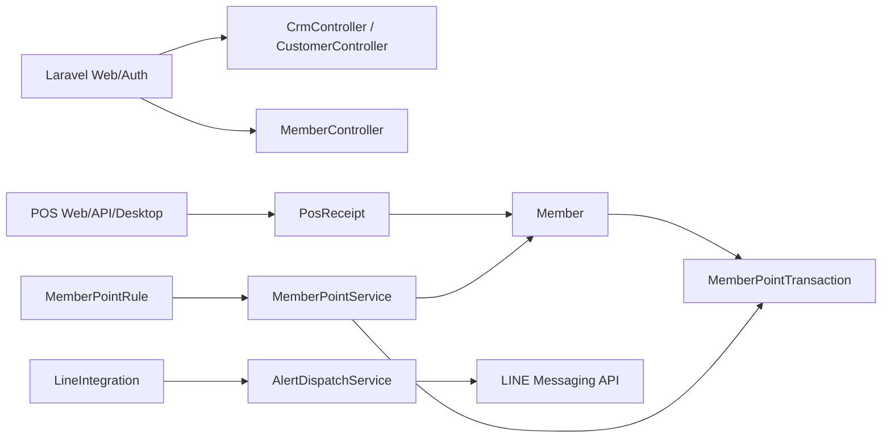

# CRM / Member / Loyalty: Existing System Analysis

**ตรวจ ณ:** 2026-09-23  
**ฐานโค้ด:** `main` / `7df2b2a`  
**ขอบเขต:** วิเคราะห์ก่อนเริ่ม Phase 1 ของ CRM, Member, Loyalty, Coupon และ LINE OA

## 1. สรุปผู้บริหาร

ระบบมีโครงสร้างที่นำกลับมาใช้ได้มากกว่าที่คาดไว้ จึงไม่ควรสร้าง `customers`, `members`,
หรือระบบแต้มชุดใหม่ทับของเดิม แต่ต้องแยกบทบาทให้ชัดเจนและค่อย ๆ ยกระดับของเดิม

- `customers` เป็น master ลูกค้าธุรกิจ/ลูกค้าเอกสาร มีที่อยู่ ผู้ติดต่อ เครดิต CRM และเอกสารทางการเงิน
- `members` เป็นสมาชิกสำหรับ POS มีรหัส ชื่อ โทรศัพท์ ประเภท สาขา และยอดแต้มปัจจุบัน
- `member_point_transactions` มี ledger แต้มอยู่แล้ว แต่ยังขาด idempotency, reference, source และการกันรายการซ้ำ
- `PosReceipt` ผูกสมาชิกได้ด้วย `member_id` อยู่แล้ว และ POS มี endpoint ค้นหาสมาชิก
- `MemberPointService` คำนวณ/ตัด/เพิ่มแต้มใน transaction และ lock สมาชิก แต่ยังใช้ `members.points` เป็นยอดหลัก
- `LineIntegration` และ `AlertDispatchService` รองรับการส่ง LINE แจ้งเตือนหลังบ้าน แต่ยังไม่ใช่ระบบผูก LINE account ของสมาชิก
- `PosCoupon` เป็นบรรทัดส่วนลดที่ผูกกับใบเสร็จ ไม่ใช่ coupon campaign/master ที่มีสิทธิ์ใช้และสถานะครบวงจร

**ข้อสรุป:** Phase 1 ควรยกระดับ `members` และ `member_point_transactions` ให้เป็นแกน loyalty,
เพิ่มความสัมพันธ์กับ customer เท่าที่จำเป็น, ทำ API ที่ใช้รูปแบบ auth เดิมของ POS และทำให้การสะสมแต้ม
เป็นผลข้างเคียงแบบ idempotent หลังขายสำเร็จ โดยไม่ทำให้การขาย offline ของ POS ต้องพึ่ง CRM/LINE

## 2. สถาปัตยกรรมที่มีอยู่

### 2.1 ลูกค้าและ CRM

`app/Models/Customer.php` เป็น customer master ที่มี `SoftDeletes` และความสัมพันธ์กับ
`addresses`, `contacts`, `openItems`, `ledgerEntries`, `documents`, `paymentDocuments`,
`crmActivities` และ `crmOpportunities` จึงเหมาะกับลูกค้าธุรกิจ/ลูกค้าเอกสาร ไม่ควรแทนที่ด้วย
ตารางสมาชิกหน้าร้านโดยตรง

`CrmController` และ routes ใน `routes/web.php` มี dashboard, activities และ opportunities/pipeline
อยู่แล้ว ระบบ CRM จึงมีฐานสำหรับงานขายสัมพันธ์ แต่ยังไม่เห็นการเชื่อม customer กับ LINE identity,
สมาชิก loyalty หรือ campaign/coupon แบบ customer-facing

### 2.2 สมาชิก POS

`database/migrations/2024_01_01_000046_create_members_table.php` สร้าง `members` ด้วย:

- `member_code` unique
- `name`, `phone`
- `member_type_id`, `branch_id`
- `points` decimal(18,4)
- `is_active`

`MemberController` อนุญาตให้แก้ `points` จากหน้าจัดการสมาชิกได้โดยตรง นี่เป็นความเสี่ยงด้าน audit
และทำให้ยอดแต้มไม่จำเป็นต้องเกิดจาก ledger

`PosController::members()` ค้นหาด้วยรหัส ชื่อ หรือโทรศัพท์ และส่ง `points` ปัจจุบันกลับไปที่ POS
จึงมีจุดต่อสำหรับ UX เดิมแล้ว แต่ควรเพิ่มข้อมูลที่จำเป็นเท่าที่ POS ใช้จริง ไม่ควรเปิดเผยข้อมูลสมาชิกเกินจำเป็น

### 2.3 แต้ม

`MemberPointRule` รองรับ rule ประเภท `earn` และ `multiplier`, ช่วงวันที่, อัตราเงินบาทต่อแต้ม,
มูลค่าแต้ม และตัวคูณ

`MemberPointTransaction` มี `member_id`, `document_id`, `direction`, `points`, `balance_after`,
`note` แต่ยังไม่มี:

- idempotency key/unique reference ต่อเหตุการณ์
- source/source_id เช่น POS receipt, return, manual adjustment
- actor/device/branch
- rule snapshot หรือข้อมูล expiry
- reversal link และเหตุผลมาตรฐาน

`MemberPointService::settle()` ใช้ `DB::transaction()` และ `lockForUpdate()` ซึ่งเป็นพื้นฐานที่ถูกต้อง
แต่การเรียกซ้ำกับเอกสารเดิมยังมีโอกาสสร้างรายการซ้ำได้ และยอดหลักยังพึ่งการ increment/decrement ที่
`members.points` ไม่ใช่ผลรวม ledger ที่ตรวจสอบได้

### 2.4 POS และการขาย

`PosReceipt` มี `member_id`, รายการสินค้า การชำระเงิน ส่วนลด coupon และสถานะบิลอยู่แล้ว
โดยต้องระวังตามกติกาโครงการว่า `cashier_id` ของ `pos_receipts` คือ user/API account และผู้ขายจริงคือ
`cashier_salesman_id`

`routes/api.php` และ `routes/web.php` มี POS member lookup อยู่แล้ว ส่วน auth เครื่องใช้ device bearer token
และ auth cashier/PIN ตาม `PosController`/middleware เดิม การเพิ่ม CRM ต้องคงหลักว่า:

1. ขายสินค้าและปิดบิลต้องทำงานได้แม้ CRM/LINE ใช้งานไม่ได้
2. การสะสมแต้ม offline ต้อง queue/sync และทำซ้ำได้โดยไม่เกิดแต้มซ้ำ
3. การแลกแต้ม/coupon online ควรตรวจสิทธิ์และยอดล่าสุดก่อนยืนยันในรุ่นแรก

## 3. LINE ที่มีอยู่และช่องว่าง

`line_integrations` และ `LineIntegrationController` เก็บ channel configuration และ token ในฐานข้อมูล
`AlertDispatchService` ใช้ token ส่ง push message ไป `https://api.line.me/v2/bot/message/push`

พบประเด็นที่ต้องแก้ก่อนเปิดใช้ customer-facing LINE:

- migration ปัจจุบันไม่มี `target_id` แต่ model/controller ใช้ `target_id` ซึ่งต้องตรวจและแก้ให้ schema ตรงกัน
- token เป็น fillable และถูกจัดการผ่านหน้าเว็บ ต้องเพิ่มการป้องกันการแสดงค่าเดิมและพิจารณา encryption/secret storage
- ยังไม่มี customer LINE identity ที่ผูกกับสมาชิกผ่าน flow ยืนยันตัวตน
- ยังไม่มี webhook endpoint, signature verification, replay protection หรือ event idempotency
- ยังไม่มีการตรวจสิทธิ์จาก LINE token ฝั่ง serverตาม flow ที่เป็นทางการ

การทำ LINE login/webhook ต้องตรวจเอกสารทางการของ LINE ก่อน implementation และห้ามเชื่อถือ
`line_user_id` ที่ส่งมาจาก frontend โดยตรง

## 4. สิ่งที่ควร reuse และสิ่งที่ควรเพิ่ม

### Reuse

- `Customer` สำหรับลูกค้าธุรกิจและข้อมูลลูกค้าที่ใช้กับเอกสาร/CRM
- `Member`, `MemberType`, `PosReceipt.member_id` สำหรับสมาชิก POS รุ่นปัจจุบัน
- `MemberPointRule` สำหรับกติกา earn/multiplier
- `MemberPointTransaction` เป็นฐาน ledger เดิม โดยเพิ่มคอลัมน์ที่จำเป็น
- `MemberPointService` เป็นจุดกลางคำนวณแต้มและ lock concurrency
- POS device auth, branch scoping, receipt/payment lifecycle และ outbox/sync pattern เดิม
- `LineIntegration`/`AlertDispatchService` สำหรับแจ้งเตือนหลังบ้าน หลังแก้ความปลอดภัยและ schema

### เพิ่มหรือปรับ

1. **Member identity:** เพิ่มข้อมูลอีเมล/สถานะ/consent ตามจำเป็น และออกแบบความสัมพันธ์กับ customer แบบไม่บังคับ
   เพื่อไม่ทำให้ลูกค้าธุรกิจทุกคนกลายเป็นสมาชิกโดยอัตโนมัติ
2. **Point ledger:** เพิ่ม event reference/idempotency, source, actor, branch/device, reversal และ expiry ตาม scope
   พร้อม backfill จาก `members.points` อย่างตรวจสอบได้
3. **Point balance:** ให้ยอด ledger เป็น source of truth; คง `members.points` ชั่วคราวเพื่อ backward compatibility
   แล้วห้ามแก้ตรงจาก UI ยกเว้นผ่าน adjustment service
4. **Coupon/campaign:** แยก master campaign, coupon issuance/redemption และ usage audit ออกจาก `pos_coupons`
   ซึ่งเป็นข้อมูลส่วนลดระดับใบเสร็จ
5. **LINE identity:** ตารางการผูกบัญชีและ webhook event log ที่มี unique event id, signature verification และ audit
6. **API:** ขยาย POS member lookup/earn/redeem โดยใช้ auth และ branch/device policy เดิม; พิจารณา versioning
   เมื่อเริ่มเปิดให้ mobile/customer client ใช้
7. **Tests:** เพิ่ม feature/unit tests สำหรับ idempotency, lock, void/return, offline replay, branch scope,
   LINE signature และการปกปิด secret

## 5. ความเสี่ยงการ migration

- ห้ามสร้าง `customers` หรือ `members` ชุดใหม่โดยไม่กำหนด ownership ของข้อมูลก่อน
- ต้องทำยอด `members.points` กับ ledger เดิมให้ตรงก่อนบังคับใช้ ledger source of truth
- ต้องไม่คำนวณแต้มซ้ำเมื่อ POS desktop replay outbox หรือ retry HTTP
- การ void/return ต้องมี reversal ledger ไม่ใช่ลบรายการเดิม
- migration ต้องรองรับทั้ง SQLite ใน test และ PostgreSQL production
- การเพิ่ม unique index ต้องตรวจข้อมูลซ้ำก่อน deploy
- token LINE ที่มีอยู่ต้องถือเป็น secret และไม่ควรแสดงผ่าน API/view หรือ log

## 6. แผน implementation หลัง Phase 0

### Phase 1: Member + Point foundation

- เพิ่ม schema ที่จำเป็นบน `members`/`member_point_transactions` และ migration data validation
- สร้าง service สำหรับ append ledger แบบ idempotent และ adjustment/reversal
- จำกัดการแก้แต้มตรงจาก controller
- เพิ่ม tests และรายงาน reconciliation ยอด member กับ ledger

### Phase 2: POS integration

- ผูก earn หลัง receipt posted สำเร็จ
- รองรับ offline outbox replay โดยใช้ reference เดียวกัน
- ทำ redeem guard, void/return reversal และ branch/device audit

### Phase 3: Coupon/campaign

- campaign/rule/issue/redeem/usage audit
- ตรวจ online ก่อน redeem; offline ใช้เฉพาะ earn ที่ออกแบบไว้

### Phase 4: LINE OA

- official login/link flow, webhook signature verification, event idempotency
- member notification preferences และส่งข้อความแบบ queue
- แยก customer LINE identity ออกจาก admin notification integration

### Phase 5: CRM/reporting

- customer 360, segment, campaign performance, point liability และ reconciliation reports
- เพิ่ม permission และ branch scoping ให้ครบก่อนเปิดใช้จริง

## 7. เกณฑ์พร้อมเริ่ม Phase 1

- ยืนยันว่า `members` คือ loyalty identity หลักของ POS และ `customers` คงบทบาทลูกค้าธุรกิจ
- ตรวจยอด `members.points` เทียบ `member_point_transactions` บนฐานจริงก่อน backfill
- ตัดสินใจ policy แต้มติดลบ, อายุแต้ม, การคืนสินค้า และการปัดเศษ
- ยืนยันว่า LINE customer account เป็นงาน Phase 4 ไม่ใช่ dependency ของการขาย

รายงานนี้เป็นผลการวิเคราะห์โค้ด ไม่ได้แก้ข้อมูล production และยังไม่ได้ทำ migration ของ CRM/Loyalty
ในระยะนี้
