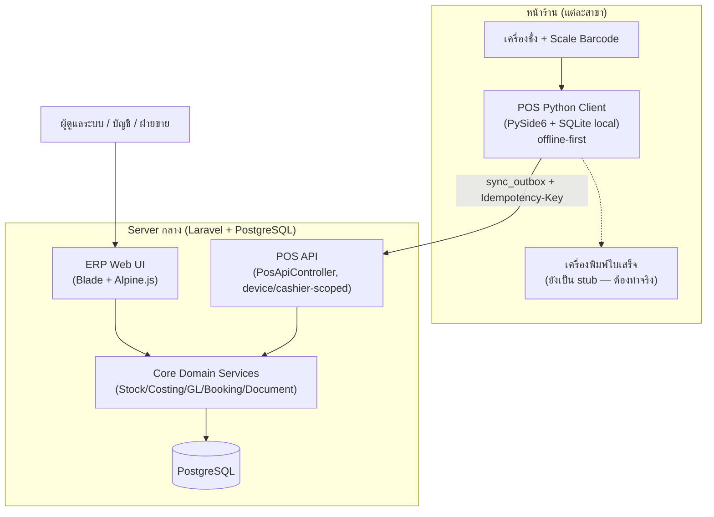
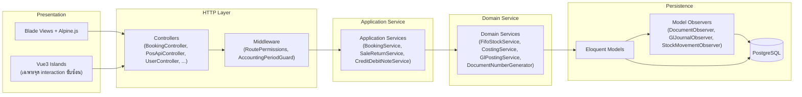
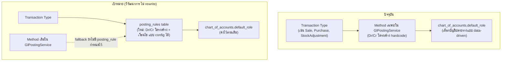
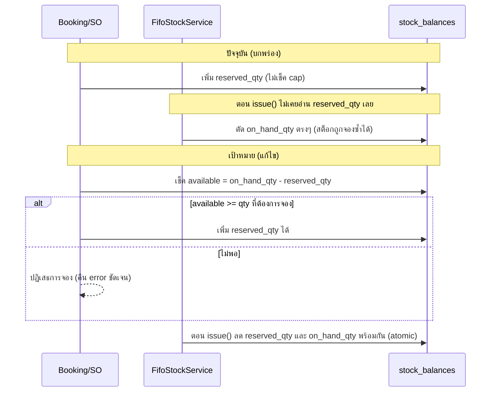

# 04 — Target Architecture

> เอกสารนี้เสนอสถาปัตยกรรมเป้าหมายของ jeterp โดยยึดหลัก **วิวัฒนาการจากของเดิม ไม่ใช่การ rewrite** — ของเดิมหลายส่วนออกแบบมาดีอยู่แล้ว (stock ledger, document numbering, offline POS sync) จุดที่ต้องเปลี่ยนคือโครงสร้างที่ทำให้ logic กระจัดกระจาย/ปนกัน ไม่ใช่เทคโนโลยีที่เลือกใช้

---

## 1. หลักการออกแบบ (Design Principles)

1. **Blade + Alpine.js ยังคงเป็น frontend หลัก** — จากการตรวจสอบจริง (`01-current-system-audit.md`) พบว่า 66 ไฟล์ใช้ `x-data` และเป็นแกนหลักของ ERP UI ทั้งหมด ส่วน Vue3 มีอยู่แค่ 3 component เกาะเล็ก ๆ เท่านั้น (`PosCartPanel.vue`, `AppLauncher.vue`, `Starter.vue`) **คำแนะนำ: ห้าม rewrite เป็น Vue3 SPA เต็มรูปแบบ** เพราะ (ก) ทีมคุ้นเคยกับ Blade+Alpine อยู่แล้ว (ข) ของเดิมทำงานถูกต้อง (ค) การ rewrite ทั้ง UI คือความเสี่ยงสูงสุดที่ไม่จำเป็น เมื่อเทียบกับผลตอบแทน ควรใช้ Vue3 island เพิ่มเฉพาะจุดที่ interaction ซับซ้อนจริง ๆ (เหมือนที่ `PosCartPanel.vue` ทำอยู่แล้ว) เท่านั้น
2. **Layered architecture แบบพอดี ไม่ over-engineer**: `Controller → Application Service → Domain Service → Repository/Eloquent Model` — ระบบมี Service layer อยู่แล้วบางส่วน (`FifoStockService`, `CostingService`, `GlPostingService`, `BookingService`) เป้าหมายคือทำให้ pattern นี้สม่ำเสมอทุกโมดูล ไม่ใช่เพิ่ม layer ใหม่ที่ไม่มีใครขอ (เช่น ไม่ต้องมี CQRS/Event-sourcing เต็มรูปแบบ)
3. **Additive migration เท่านั้น**: ทุกการเปลี่ยนแปลงต้องเป็น migration ใหม่ (เพิ่มตาราง/คอลัมน์) ไม่ใช่ rename/drop ของเดิม — ตามกฎที่ผู้ใช้กำหนดไว้อย่างชัดเจน
4. **POS Python client คงสถาปัตยกรรม offline-first เดิม** — ไม่เปลี่ยนไปเป็น online-only เพราะสภาพแวดล้อมร้านค้าจริง (เน็ตหลุด) เป็นเหตุผลหลักที่ออกแบบมาแบบนี้

---

## 2. System Context Diagram

---

## 3. Layered Architecture (ERP Web ฝั่ง Server)

**หมายเหตุ**: โครงสร้างนี้ **มีอยู่แล้วบางส่วนในระบบจริง** — งานที่ต้องทำคือทำให้โมดูลที่ยัง logic ปนอยู่ใน Controller (พบใน audit ว่าบาง Controller ทำ business logic เองโดยตรงแทนที่จะเรียก Service) ย้ายเข้า Application/Domain Service ให้สม่ำเสมอ ไม่ใช่สร้าง layer ใหม่

---

## 4. Posting Rule Evolution (ไม่ rewrite `GlPostingService`)

แนวทาง: เพิ่มตาราง `posting_rules` เป็นชั้นทางเลือก (optional layer) ที่ `GlPostingService` เช็คก่อน ถ้าไม่มี rule ที่ config ไว้ให้ fallback ไปที่ method เดิมที่ทำงานถูกต้องอยู่แล้ว — วิธีนี้ทำให้ transaction type ที่ยังไม่ migrate ยังทำงานเหมือนเดิมทุกประการ ไม่มีความเสี่ยง regression

---

## 5. Reservation Enforcement (แก้จุดวิกฤตจาก Gap Analysis)

รายละเอียดเชิงเทคนิคเพิ่มเติมอยู่ใน `06-inventory-architecture.md`

---

## 6. สิ่งที่ต้อง "คงไว้" ไม่แตะต้อง (Explicit Preserve List)

จุดเหล่านี้ตรวจสอบแล้วว่าออกแบบถูกต้องและทำงานได้ดี **ห้ามแตะในทุกเฟส**:

- `DocumentNumberGenerator` + `document_sequences` (concurrency-safe, มี incident history ยืนยัน)
- Stock ledger 3 ชั้น: `stock_movements`/`stock_lots`/`stock_balances`
- Dual costing (`average_cost` แบบ moving-average + FIFO-lot cost สำหรับ COGS)
- FEFO opt-in ต่อสินค้า (`tracks_expiry`)
- POS offline-first sync (`sync_outbox` + `Idempotency-Key` + `pos_api_idempotency`)
- Device-bound cashier/PIN verification (`PosDevice::markCashierVerified`)
- `AccountingPeriodGuard` ผ่าน Model Observer
- Idempotent GL posting (delete-then-repost)
- `erp:health`/`erp:readiness` invariant check commands
- Blade + Alpine.js เป็น frontend หลัก

---

## 7. สรุป

สถาปัตยกรรมเป้าหมายไม่ใช่การ "เปลี่ยนเทคโนโลยี" แต่เป็นการ **เติมช่องว่างที่ระบุใน gap analysis เข้าไปในโครงสร้างที่มีอยู่แล้ว** ผ่านสามกลไกหลัก: (1) posting_rules เป็น optional layer เหนือ `GlPostingService` เดิม (2) reservation enforcement ที่ `FifoStockService::issue()` (3) unified document state model ที่เป็น additive mapping ไม่ใช่การเปลี่ยนค่าจริงในฐานข้อมูล รายละเอียดเชิงลึกของแต่ละส่วนอยู่ในเอกสาร 05-08
