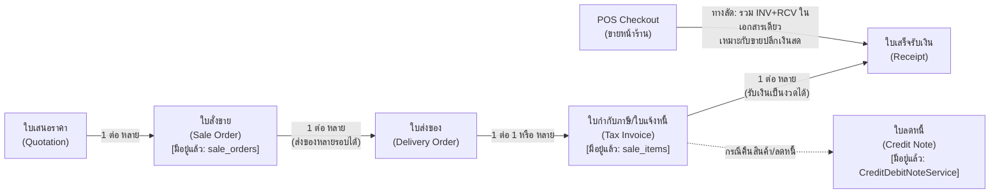
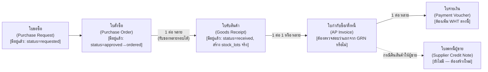

# 05 — Document Flow (Sales/AR & Purchase/AP)

> เอกสารนี้กำหนด flow ของเอกสารแบบ "แต่ละเอกสารคือ record อิสระ อ้างอิงกันด้วย FK ไม่ merge เป็น transaction เดียว" — เป็นหลักการบัญชีพื้นฐานที่ PEAK ใช้และ jeterp ควรยึดตามเช่นกัน (ใบเสนอราคา ≠ ใบสั่งขาย ≠ ใบกำกับภาษี ≠ ใบเสร็จรับเงิน แม้จะมาจาก "การขายครั้งเดียวกัน")

---

## 1. Sales / AR Flow

### 1.1 Flow เป้าหมาย (ยึดจากแนวคิด PEAK + ของเดิมที่มีอยู่ใน jeterp)

**ของเดิมที่มีอยู่แล้วและถูกต้อง**: `sale_orders`/`sale_items`, `CreditDebitNoteService` (ผ่าน `pending_approval` ถูกต้องตามหลักบัญชี)

**Gap ที่ต้องปิด (จาก 03-gap-analysis.md)**:
- `SaleReturnService::create()` ต้องแก้ให้ผ่าน `pending_approval` เหมือน `CreditDebitNoteService` (ปัจจุบันโพสต์ GL/stock ทันที — **P0**)
- ใบส่งของ (Delivery Order) แยกจากใบแจ้งหนี้ — ต้องตรวจสอบว่ามีจริงหรือไม่ ถ้าไม่มีให้เพิ่มเป็นเอกสารอิสระ (สำหรับกรณีขายส่งที่ส่งของก่อนวางบิล)

**หลักการสำคัญ**: POS checkout (ขายปลีกหน้าร้าน) ใช้ทางลัดรวม "ออกใบกำกับ + รับเงิน" ในธุรกรรมเดียวได้ (ตามที่ระบบทำอยู่แล้วและถูกต้องสำหรับขายปลีกเงินสด) แต่ **การขายส่ง (Wholesale) ต้องแยกเอกสารตาม flow เต็มด้านบน** เพราะมีการวางบิล/เครดิตเทอมที่ไม่ใช่เงินสดทันที — นี่คือจุดที่ต้องรองรับทั้ง 2 โหมดคู่ขนาน ไม่ใช่บังคับ flow เดียวกับทุก transaction

### 1.2 Cardinality สรุป

| จาก | ไป | ความสัมพันธ์ | สถานะ |
|---|---|---|---|
| Quotation | Sale Order | 1:N (ใบเสนอราคาเดียวแตกเป็นหลายใบสั่งขายได้ เช่น ลูกค้าสั่งบางส่วน) | ต้องตรวจสอบว่ามี FK รองรับ |
| Sale Order | Delivery Order | 1:N (ส่งของหลายรอบจากใบสั่งขายเดียว) | ต้องตรวจสอบว่ามีจริง |
| Delivery Order/Sale Order | Tax Invoice | N:1 หรือ 1:1 (รวมหลายใบส่งของเป็นใบแจ้งหนี้เดียวได้) | มีอยู่แล้วบางส่วน (`sale_items`) |
| Tax Invoice | Receipt | 1:N (รับเงินเป็นงวด/ผ่อนชำระ) | ต้องตรวจสอบ |
| Tax Invoice | Credit Note | 1:N (ลดหนี้บางส่วนหลายครั้งได้) | มีอยู่แล้ว (`CreditDebitNoteService`) |

---

## 2. Purchase / AP Flow

### 2.1 Flow เป้าหมาย

**ของเดิมที่มีอยู่แล้วและถูกต้อง**: Lifecycle `requested→approved→ordered→received` พร้อม FIFO receiving จริง (สร้าง `stock_lots` ตอนรับของ)

**Gap ที่ต้องปิด**:
- ตรวจสอบว่า AP Invoice เป็นเอกสารแยกจาก GRN หรือถูกผูกรวมกัน ถ้าผูกรวมให้แยกออกมาเป็นเอกสารอิสระ (จำเป็นสำหรับกรณีที่ผู้ขายส่งใบกำกับมาช้ากว่าของ)
- `purchase_order_items` ไม่มี `unit_id` — ต้องเพิ่มเพื่อรองรับการสั่งซื้อเป็นหน่วยที่ต่างจากหน่วยฐาน (**P1**)
- Withholding Tax ต้องคำนวณตอนสร้าง Payment Voucher ไม่ใช่ตอน AP Invoice (ตามหลักภาษีไทย หัก ณ ที่จ่ายเกิดขึ้นตอนจ่ายเงินจริง)
- Supplier Credit Note ยังไม่มี — ต้องสร้างใหม่โดยใช้ pattern เดียวกับ `CreditDebitNoteService` ฝั่งลูกค้า (ผ่าน `pending_approval`)

### 2.2 Cardinality สรุป

| จาก | ไป | ความสัมพันธ์ | สถานะ |
|---|---|---|---|
| Purchase Request | Purchase Order | 1:1 หรือ 1:N (แยกคำขอเป็นหลาย PO ตามผู้ขาย) | มีอยู่แล้ว |
| Purchase Order | Goods Receipt | 1:N (รับของหลายรอบจาก PO เดียว — สั่งเยอะ ทยอยส่ง) | มีอยู่แล้ว |
| Goods Receipt | AP Invoice | N:1 (รวมหลายใบรับของเป็นใบกำกับซื้อเดียว) | ต้องตรวจสอบ |
| AP Invoice | Payment Voucher | 1:N (จ่ายเป็นงวด) | ต้องตรวจสอบ |
| AP Invoice | Supplier Credit Note | 1:N | ยังไม่มี — ต้องสร้าง |

---

## 3. หลักการที่ต้องยึดทุกกรณี

1. **ห้าม merge เอกสารต่างประเภทเป็น transaction เดียวในฐานข้อมูล** ยกเว้นกรณี POS retail checkout ที่ยอมรับได้ตามที่ระบบทำอยู่แล้ว (ใบกำกับ+ใบเสร็จรวมกันสำหรับขายปลีกเงินสด) — ขายส่งต้องแยกเอกสารเสมอ
2. **ทุกเอกสารอ้างอิงเอกสารต้นทางด้วย FK ไม่ใช่ copy ข้อมูล** เพื่อให้ audit trail ตามรอยได้ (document relation แบบ parent-child ผ่าน `source_document_id`/`source_document_type` pattern)
3. **การยกเลิก/แก้ไขเอกสารที่ผ่านการโพสต์บัญชีแล้ว ต้องออกเอกสารกลับรายการใหม่เสมอ ห้าม UPDATE/DELETE ของเดิม** — ตรงกับกฎที่ผู้ใช้กำหนด "ห้ามลบข้อมูล ห้ามแก้ไขยอดขายเดิม"
4. **สถานะเอกสาร (status) ทุกประเภทต้องผ่าน unified state model** ที่กำหนดใน `07-accounting-architecture.md` แทนการปล่อยเป็น string อิสระต่อโมดูล
