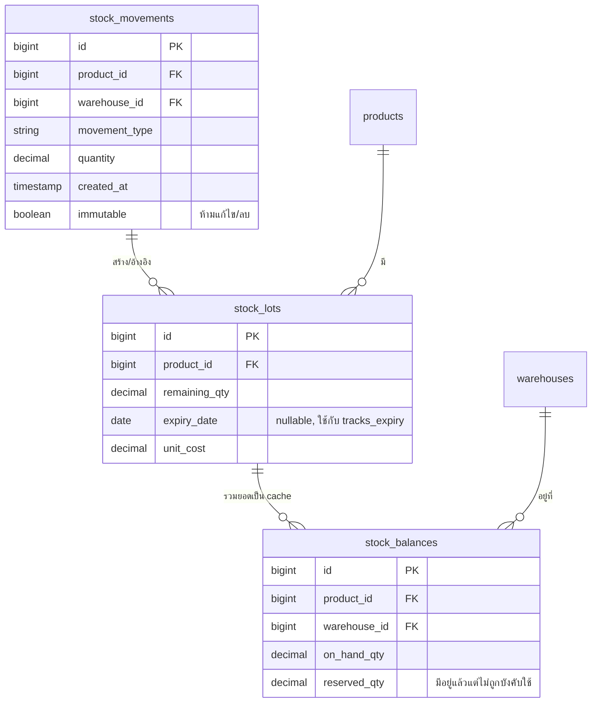
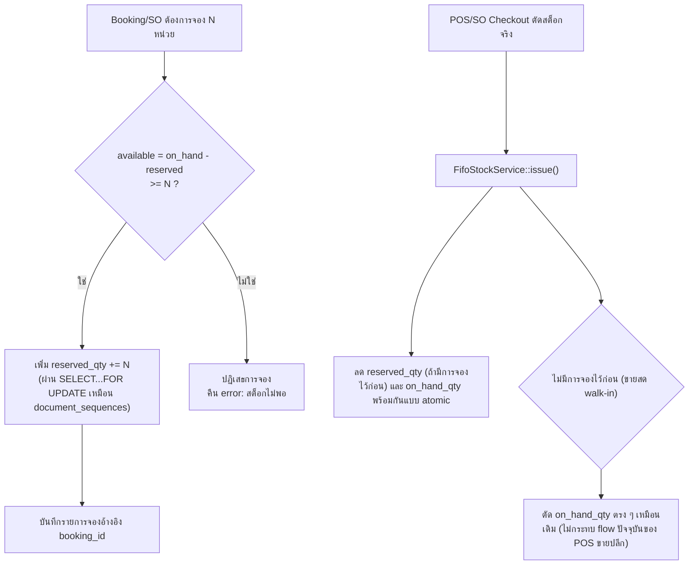
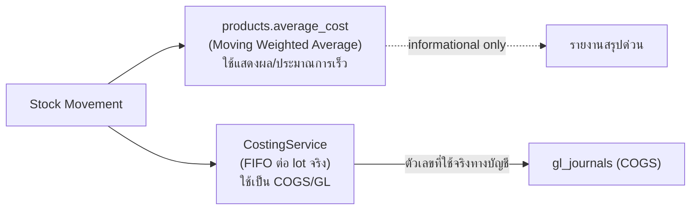

# 06 — Inventory Architecture

> สถาปัตยกรรมสต็อกของ jeterp **ดีกว่า PEAK อยู่แล้วในเชิงโครงสร้าง** (PEAK ไม่มี concept คลังสินค้าเชิงลึกเลย) เอกสารนี้เน้นที่การ **แก้จุดที่บกพร่อง** ไม่ใช่ออกแบบใหม่ทั้งหมด

---

## 1. Stock Ledger 3 ชั้น — สถานะ: KEEP (คงไว้)

โครงสร้างปัจจุบัน:

`stock_movements` เป็น immutable ledger, `stock_lots` เก็บต้นทุนต่อ lot สำหรับ FIFO, `stock_balances` เป็น cache ที่คำนวณเร็ว — สถาปัตยกรรมนี้ **ถูกต้องตามหลัก inventory accounting และเหนือกว่า PEAK** ให้คงไว้ทั้งหมด

---

## 2. Reservation Enforcement — สถานะ: MUST FIX (P0)

### 2.1 ปัญหาที่พบจริง (จาก code evidence)

- `FifoStockService::issue()` **ไม่เคยอ่านค่า `reserved_qty` เลย** ตอนตัดสต็อกจริง (ยืนยันจาก subagent audit ที่อ่านโค้ดจริง)
- ตอน booking เพิ่ม `reserved_qty` โดยไม่มีการเช็ค cap ว่าจองเกิน available หรือไม่
- ผลคือ: สต็อก 1 หน่วยสามารถถูกจอง (reserve) ซ้ำได้หลายครั้งพร้อมกัน แล้วตอนตัดจริงก็ตัดจาก `on_hand_qty` ตรง ๆ ไม่สนใจว่ามีใครจองไว้ก่อนหรือไม่ — **เท่ากับว่า reservation เป็นแค่ตัวเลขที่ไม่มีผลบังคับใช้จริงเลยทั้งระบบ**

### 2.2 การแก้ไขที่เสนอ

**สูตรที่ต้องบังคับใช้ทุกจุด**: `available_qty = on_hand_qty - reserved_qty`

**หลักการสำคัญของการแก้**: ใช้ **row-level lock pattern เดียวกับที่ `DocumentNumberGenerator` ใช้อยู่แล้ว** (`SELECT...FOR UPDATE`) เพื่อป้องกัน race condition ตอนจองพร้อมกันหลาย transaction — ไม่ต้องคิดกลไกใหม่ เพราะระบบมี pattern ที่พิสูจน์แล้วว่าใช้ได้จริงอยู่แล้ว

**ผลกระทบต่อ POS ขายปลีก**: ขายปลีกหน้าร้าน (walk-in) ส่วนใหญ่ไม่ผ่านการจองล่วงหน้าอยู่แล้ว จึงไม่กระทบ flow เดิม — การแก้นี้กระทบเฉพาะ booking/SO ที่มีการจองล่วงหน้าจริง

---

## 3. FEFO (First-Expired-First-Out) — สถานะ: KEEP

`tracks_expiry` เป็น opt-in ต่อสินค้า, ทำงานถูกต้องแล้วสำหรับสินค้าที่มีวันหมดอายุ (จำเป็นมากสำหรับธุรกิจอาหารแช่แข็ง) — คงไว้ทั้งหมด ไม่ต้องแก้

---

## 4. Costing (Dual Method) — สถานะ: KEEP

Dual costing นี้ **ตั้งใจออกแบบมาถูกต้อง** ไม่ใช่ความสับสน — average cost ใช้ดูภาพรวมเร็ว (ไม่ต้อง query lot ทุกครั้ง) ส่วน FIFO lot cost ใช้เป็นตัวเลขจริงสำหรับ COGS/บัญชี ให้คงแยกกันไว้แบบนี้ต่อไป

---

## 5. Multi-Branch / Multi-Warehouse / Multi-Location

โครงสร้างปัจจุบันรองรับ branch→warehouse อยู่แล้ว (ยืนยันจาก audit) แต่ไม่มีระดับ Company/Tenant เหนือ branch (ซึ่งเหมาะสมแล้วเพราะเป็น single-tenant ตามที่ออกแบบ) ข้อเสนอสำหรับอนาคต:

- `stock_balances` ควร scope ด้วย `warehouse_id` เสมอ (ตรวจสอบว่า multi-warehouse ต่อ branch รองรับครบทุก query หรือยัง — ไม่พบปัญหาชัดเจนจาก audit แต่ควรมี regression test ครอบคลุมกรณีนี้)
- Location ระดับ bin/shelf ภายใน warehouse (ยังไม่มี) — เป็น P3 เท่านั้น เหมาะกับธุรกิจที่ warehouse ใหญ่มากจริง ๆ ซึ่งยังไม่ใช่ priority ตอนนี้

---

## 6. Stock Transfer ระหว่างสาขา — ข้อเสนอ GL Treatment

ปัจจุบันมี Stock Transfer พร้อม 2-phase approval + FIFO-lot-valued GL posting เข้าบัญชี `5030` แล้ว (ALREADY EXISTS, ทำงานถูกต้อง) ข้อเสนอเพิ่มเติมสำหรับความชัดเจนทางบัญชี:

- ใช้บัญชีพักระหว่างทาง "สินค้าระหว่างทาง" (Stock-in-Transit) แทนการโอนตรงจากสาขาต้นทางไปสาขาปลายทางในธุรกรรมเดียว หากการขนส่งใช้เวลาหลายวัน — ทางเลือกนี้เป็น P2 (ไม่เร่งด่วน) เพราะของเดิมที่ post ตรงยังใช้งานได้สำหรับ transfer ที่เสร็จในวันเดียว

---

## 7. สรุปตาราง KEEP/FIX

| ส่วนประกอบ | สถานะ | Priority |
|---|---|---|
| Stock ledger 3 ชั้น (movement/lot/balance) | KEEP | — |
| FEFO | KEEP | — |
| Dual costing (avg + FIFO) | KEEP | — |
| Stock Adjustment/Transfer/Count 2-phase approval | KEEP | — |
| **Reservation enforcement** | **FIX (ยังไม่ทำงานจริง)** | **P0** |
| Stock-in-Transit account สำหรับ transfer ข้ามวัน | เพิ่มใหม่ (optional) | P2 |
| Location ระดับ bin/shelf | อนาคต | P3 |
