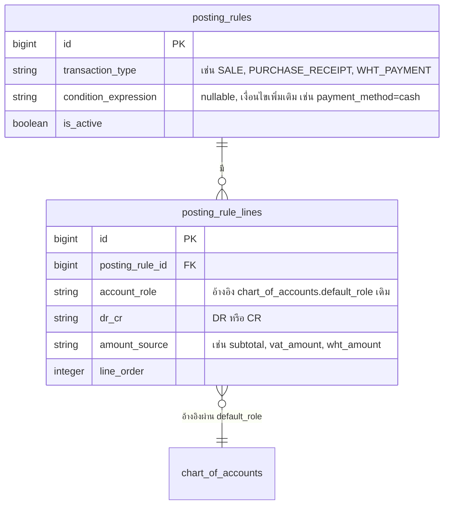
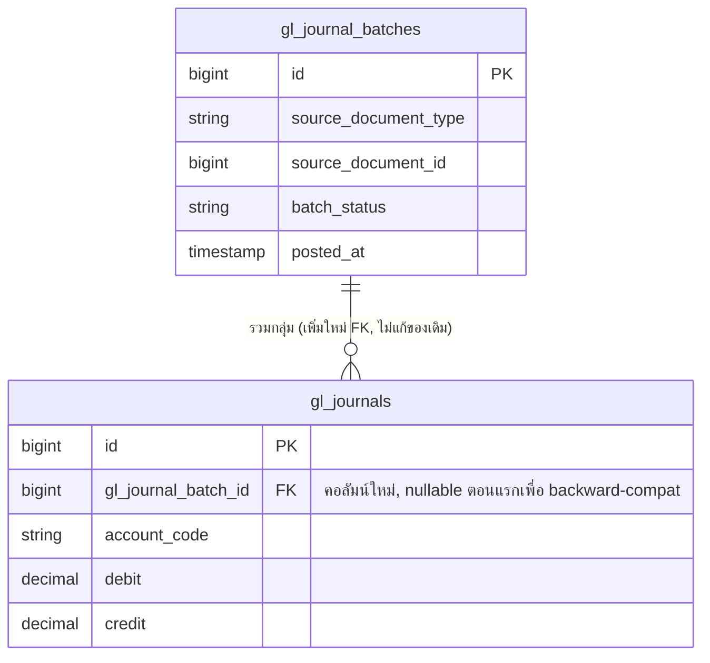
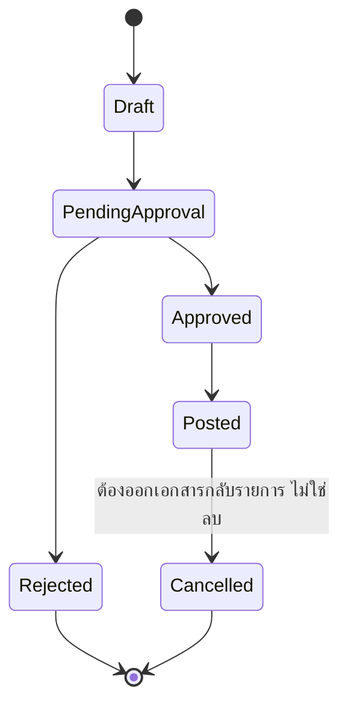
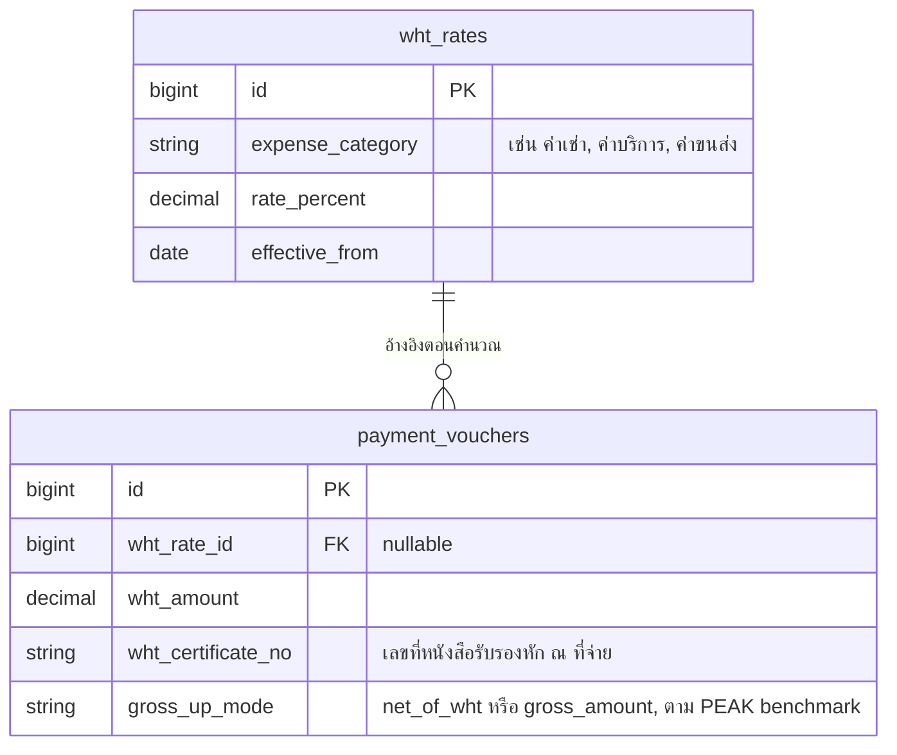

# 07 — Accounting Architecture

> `GlPostingService` ปัจจุบันทำงานถูกต้องและมี idempotent posting + period-close guard ที่ดีอยู่แล้ว เอกสารนี้เสนอ **วิวัฒนาการแบบ additive** ไม่ใช่ rewrite เพื่อปิดช่องว่างจาก gap analysis (posting rule ที่ hardcode, journal ไม่มี header, ไม่มี WHT, document state ไม่เป็น state machine, และ inconsistency ระหว่าง `SaleReturnService`/`CreditDebitNoteService`)

---

## 1. Posting Rule Abstraction (วิวัฒนาการจาก `GlPostingService` เดิม)

### 1.1 ของเดิม (ยืนยันจาก code)

`GlPostingService` เป็น hybrid: โครงสร้าง Dr/Cr **hardcode เป็น method แยกต่อประเภทธุรกรรม** (เช่น `postSale()`, `postPurchaseReceipt()`, `postStockAdjustment()`) แต่การเลือกบัญชีปลายทางจริงเป็น data-driven ผ่าน `chart_of_accounts.default_role` (ROLE_CASH, ROLE_SALES_REVENUE, ROLE_VAT_OUTPUT, ฯลฯ)

### 1.2 ข้อเสนอ: เพิ่มตาราง `posting_rules` เป็น optional layer

**กลไก fallback**: `GlPostingService` เช็คก่อนว่ามี `posting_rules` ที่ active สำหรับ transaction type นั้นหรือไม่ — ถ้ามี ใช้ rule ที่ config ไว้; ถ้าไม่มี **fallback ไปที่ method เดิมที่ทำงานถูกต้องอยู่แล้วทันที** วิธีนี้ทำให้ transaction type ทั้งหมดที่ยังไม่ migrate ไม่ได้รับผลกระทบเลย (zero regression risk) และเปิดทางให้ค่อย ๆ ย้าย transaction type ทีละประเภทไปใช้ตาราง config ได้ตามความจำเป็น (เริ่มจาก WHT ซึ่งเป็นของใหม่ทั้งหมดอยู่แล้ว ไม่มี method เดิมให้ fallback)

---

## 2. Journal Header/Batch (เติมบน `gl_journals` เดิม)

### 2.1 ปัญหา

`gl_journals` เป็นตารางเดียวแบบ flat ไม่มี concept "ชุดรายการ" (batch) — ทำให้ดู/reverse journal เป็นชุดยาก (ต้อง group ด้วย reference field แทน FK จริง)

### 2.2 ข้อเสนอ

เพิ่มคอลัมน์ `gl_journal_batch_id` แบบ **nullable** ใน `gl_journals` เดิม (migration แบบ additive) — journal เก่าที่ post ไปแล้วไม่ต้อง backfill ทันที (ปล่อยเป็น null ได้) journal ใหม่ค่อย ๆ เริ่มผูก batch ตั้งแต่วันที่ deploy

---

## 3. Document State Model (Unified, ไม่ rename ค่าเดิม)

### 3.1 ปัญหา

`documents.status` เป็น varchar เปล่าไม่มี constraint และแต่ละโมดูลใช้คำศัพท์ต่างกัน (เช่น บาง module ใช้ "active"/"cancelled" บางที่ใช้ "approved"/"rejected")

### 3.2 ข้อเสนอ: Mapping Layer แทนการ rename

เพิ่มตาราง `document_status_definitions` ที่ map ค่า status จริงที่ใช้อยู่ในแต่ละ module (เช่น "active" ของ module A) ไปยัง canonical state (`Posted`) ข้างต้น — เขียน service-layer transition guard (`DocumentStatusTransitionService`) ที่เช็คว่า transition ที่ขอทำถูกต้องตาม state diagram หรือไม่ **โดยไม่แตะค่า string จริงในฐานข้อมูลเดิมเลย** เป็นเพียง lookup/validation layer เพิ่มเติม

---

## 4. Tax Architecture: WHT (Withholding Tax)

### 4.1 ปัจจุบัน: ไม่มีเลย (MISSING, P0)

### 4.2 ข้อเสนอ

Posting: เพิ่ม role ใหม่ `ROLE_WHT_PAYABLE` ใน `chart_of_accounts.default_role` (ใช้ pattern เดิมที่มีอยู่แล้ว ไม่ต้องคิดกลไกใหม่) แล้วสร้าง posting rule (ตามข้อ 1) สำหรับ transaction type `WHT_PAYMENT` — DR ค่าใช้จ่าย/เจ้าหนี้, CR เงินสด+ภาษีหัก ณ ที่จ่ายค้างจ่าย

---

## 5. แก้ Inconsistency: `SaleReturnService` vs `CreditDebitNoteService`

### 5.1 ปัญหาที่พบจริง (Critical)

- `CreditDebitNoteService`: สร้างด้วย `pending_approval` → โพสต์ GL/stock **เฉพาะตอนอนุมัติแล้ว** (ถูกต้อง)
- `SaleReturnService::create()`: โพสต์กลับรายได้และรับคืนสต็อก **ทันทีด้วย `status='active'`** (ขัดกับกฎเดียวกันที่ทีมเขียนไว้เอง)

### 5.2 การแก้ไข

แก้ `SaleReturnService::create()` ให้สร้าง record ด้วย `status='pending_approval'` เหมือน `CreditDebitNoteService` แล้วย้าย logic การโพสต์ GL + คืนสต็อกไปอยู่ใน method `approve()` (pattern เดียวกับที่ `CreditDebitNoteService` มีอยู่แล้ว) — เป็นการ **แก้บั๊กให้ตรงกับ pattern ที่ถูกต้องซึ่งมีอยู่แล้วในระบบ ไม่ใช่การออกแบบใหม่**

---

## 6. สรุปตาราง

| ส่วนประกอบ | สถานะ | แนวทาง | Priority |
|---|---|---|---|
| `GlPostingService` core logic | KEEP | คงไว้เป็น fallback | — |
| Posting Rule table | เพิ่มใหม่ (additive, optional layer) | เริ่มจาก WHT transaction type | P1 |
| Journal header/batch | เพิ่มคอลัมน์ nullable | ไม่ backfill ของเก่า | P1 |
| Document state model | เพิ่ม mapping layer | ไม่แตะค่าเดิมในฐานข้อมูล | P1 |
| WHT rate table + gross-up | เพิ่มใหม่ทั้งหมด | ตาม PEAK benchmark 2 โหมด | P0 |
| `SaleReturnService` approval gap | แก้บั๊ก | ใช้ pattern ของ `CreditDebitNoteService` | P0 |
